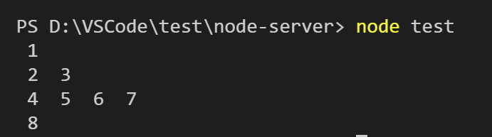

# 2020美团前端一面算法题
---
*2020/11/03*

## 前言

::: tip
  学习群里朋友分享的美团前端面试几个算法题。
:::

## 跳台阶

::: tip
  问：一只青蛙一次可以跳上1级台阶，也可以跳上2级。求该青蛙跳上n级的台阶总共有多少种跳法（先后次序不同算不同的结果）。

  答：这种入参只有一个 n 的，大概率是需要用到递归，那怎么个递归法呢，我们先想一下，我 n 级台阶跳法和 n-1 级有什么关系，n-1 级之后再跳一级就是了，说明到目前为止，n 级台阶的跳法和 n-1 级台阶跳法是一样的，因为每次都是在 n-1 级跳法的基础上最后再多上一级台阶。那和 n-2 级台阶跳法是什么关系呢，和前面 n-1 类似，也是在 n-2 级每次跳法最后再跳2级即可。也许有人会想，我跳了 n-2 级之后还有2级，我可以1级1级跳2次，那其实达到 n-2 级之后再跳1级的跳法已经算在 n-1 级跳法里面了。所以 n 级跳法应该是 n-1 级和 n-2 级跳法的总和，代码如下：

``` js
const jumpFloor = number => {
  if(number <= 2) {
    return number // 1 级，1种跳法；   2 级 2种跳法
  }

  return jumpFloor(number - 2) + jumpFloor(number - 1)
}
```

  其实可以发现就是一个斐波那契数列，递归非常耗内存，容易造成内存溢出，可以对递归尾调用优化下：

``` js
const jumpFloor = (number, current = 1, next = 2) => {
  if(number <= 2) {
    return next
  }

  return jumpFloor(number - 1, next, current + next)
}
```
:::

## 把二叉树打印成多行

::: tip
  问：从上到下按层打印二叉树，同一层结点从左至右输出。每一层输出一行。

  答：从上到下依次打印二叉树，可以用队列实现对树的广度遍历，题目又要求分层，那得缓存每一层的最后一个结点，实现如下：

``` js
/* 
  先构造一颗树
          1
        2   3
      4 5  6  7
    8
*/
const node8 = { val: 8 }
const node7 = { val: 7 }
const node6 = { val: 6 }
const node5 = { val: 5 }
const node4 = { val: 4, left: node8 }
const node3 = { val: 3, left: node6, right: node7 }
const node2 = { val: 2, left: node4, right: node5 }
const root = { val: 1, left: node2, right: node3 }

const print = root => {
  if(!root) return

  let lineLast, // 保存当前层的最后一个结点
      next, // 下一层的最后一个结点
      current // 当前结点
  const queue = [root] // 树广度优先遍历队列
  next = root // 第一层只有一个结点
  while(queue.length > 0) {
    lineLast = next
    let lineString = ''

    while(true) {
      current = queue.shift() // 取出队列第一个结点
      lineString += ` ${current.val} `

      if(current.left) {
        queue.push(current.left) // 将当前结点左子结点添加到队列末尾
        next = current.left // 也许当前结点左子节点为下一层最后一个结点
      }

      if(current.right) {
        queue.push(current.right) // 将当前结点右子结点添加到队列末尾
        next = current.right // 当前结点右子节点覆盖左子节点，为下一层最后一个结点
      }

      if(current === lineLast) { // 如果当前结点时该层最后一个结点，打印输出
        console.log(lineString)
        break
      }
    }
  }
}
```

  
:::

## 数字在升序数组中出现的次数

::: tip
  问：统计一个数字在排序数组中出现的次数。

  答：在有序数组中找一个数，首先想到二分查找，还需要统计出现的次数，那么就在它相邻位置检查一下即可，实现如下：

``` js
const getNumberOfK = (data, k) => {
  const binarySearch = (data, k, start = 0, end = data.length) => {
    let middle = Math.floor((start + end) / 2)

    if(data[middle] === k) {
      return middle
    } else if(data[middle] < k){
      return binarySearch(data, k, middle + 1, data.length)
    } else {
      return binarySearch(data, k, 0, middle - 1)
    }
  }

  const index = binarySearch(data, k)
  let current = index,
      count = 1 // index 位置本身1次
  while(current < data.length && data[++current] === k) {
    count++
  }
  current = index
  while(current >= 0 && data[--current] === k) {
    count++
  }

  return count
}
```

  [回首页](/algorithm)
:::

（完）