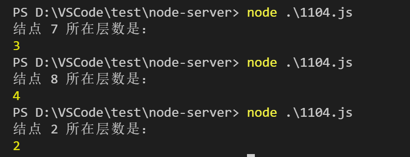

# 几个二叉树相关的算法题
---
*2020/11/04*

## 前言

::: tip
  在一个群里看到说，一位35岁的程序员去面试，连二叉树中给定两个结点，求这两个结点最近公共祖先的算法题都做不出来，一群评论都是"活该"的样子，吓得我赶紧写篇文章记录下解法，到时候拿出来看看。

  由于今天都是二叉树，先给出一个二叉树参数：

``` js
/**
            1
          2   3
        4  5 6  7
      8
 */

const node8 = { val: 8 }
const node7 = { val: 7 }
const node6 = { val: 6 }
const node5 = { val: 5 }
const node4 = { val: 4, left: node8 }
const node3 = { val: 3, left: node6, right: node7 }
const node2 = { val: 2, left: node4, right: node5 }
const root = { val: 1, left: node2, right: node3 }
```
:::

## 最近公共祖先

::: tip
  先思考一下，如果给的节点是4和5，那么他们的最近公共祖先是2，如果是4和6呢，他们最近的公共祖先是根节点1，也就是说这个公共祖先是肯定存在的，那怎么确定最近的那个呢。也就是说最近公共结点如果不是根结点，那么应该在左子树，或者在右子树，那么我们就可以用递归去解决，如果根结点不是，那就分别去根节点的左、右子树中找，代码如下：

``` js
const findParent = (root, p, q) => {
  // 如果root结点不为 undefined，但是它等于 p 或 q 结点，则直接返回 root 结点
  // 因为p、q 最近公共祖先不可能在 p、q 结点的下面
  if(!root || root === p || root === q) {
    return root
  }

  // 分别查看左右子树中是否有目标结点，如果没有，则返回 undefined
  const left = findParent(root.left, p, q)
  const right = findParent(root.right, p, q)

  // left、right 都不为 undefined，那它们的值必然和 p、q 结点对应，说明 root 结点就是我们需要找的结点
  if(left && right) {
    // p === left && q === right
    // 或 p === right && q === left
    return root
  } 

  // 如果left、right有一个为 undefined，说明这边子树没有找到，返回不为 undefined 的那个结点
  return left ? left : right
}
```

  
  
:::

## 到某个结点最短路径

::: tip
  当看到 **最短** 这两个字的时候，首先想到的是广度优先遍历，但是广度优先遍历有一个问题，它的路径不好保存，因为它前后节点之间并没有明确的父子关系。所以就想想深度优先遍历，深度优先遍历路径很明确，并且当它在叶子结点还没有找到的话，还可以回溯到父节点继续去另一个子节点下找，那我们要做的就是增加一个标识，来标识有没有找到，如果没有找到，就需要把当前结点从路径中移除，代码如下

``` js
const miniPath = (root, node, path) => {
  if(!root) return false

  // 如果结点不为空，则将当前结点值加入 path 数组
  path.push(root.val)
  if(root.val === node.val) {
    return true
  }
  // 当前结点还不是目标结点，继续在这个结点的左右子树中找
  let hasFound = false
  if(root.left) {
    hasFound = miniPath(root.left, node, path)
  }
  if(!hasFound && root.right) {
    hasFound = miniPath(root.right, node, path)
  }
  if(!hasFound) {
    // 左右结点都没有找到，将当前结点从 path 数组中移除
    path.pop()
  }

  return hasFound
}
```

  
:::

## 某个结点所在层级

::: tip
  这个相比上两个问题就简单些了，没有路径，直接用广度优先遍历，再加个分层标识即可，和上一篇中的 [分层打印二叉树](./20201103.html#把二叉树打印成多行) 很类似。直接贴代码了：

``` js
const getLevelCount = (root, node) => {
  if(!root) return 0

  let lineLast, // 保存当前层的最后一个结点
      next, // 下一层的最后一个结点
      current, // 当前结点
      levelCount = 1 // 层数 
  const queue = [root] // 树广度优先遍历队列
  next = root // 第一层只有一个结点
  while(queue.length > 0) {
    lineLast = next

    while(true) {
      current = queue.shift()

      if(current.val === node.val) {
        return levelCount
      }

      if(current.left) {
        queue.push(current.left)
        next = current.left
      }

      if(current.right) {
        queue.push(current.right)
        next = current.right
      }

      if(current === lineLast) {
        levelCount++
        break
      }
    }
  }

  return -1
}
```

  

  [回首页](/algorithm)
:::

（完）