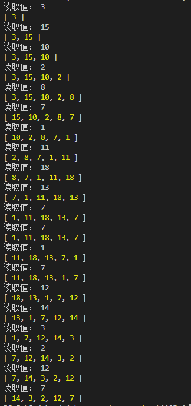

# JS Array 和 LinkedList 实现 LRU
---
*2020/11/05*

## 前言

::: warning
  LRU 是 Least Recently Used 的缩写，即最近最少使用，是一种常用的 **页面置换算法**，选择最近最久未使用的页面予以淘汰。
:::

## 思路

::: tip
  首先 **最久未使用予以淘汰**，那可以考虑使用队列来作为缓存容器。再者，如果对象已经存在缓存中，则需将该值移到队列最后位置。如果用遍历队列来判断该值是否在队列中，则效率不高，这里可以考虑增加一个 Set 集合，来保存缓存数据。即用队列配合 Set 集合来解决 LRU 问题，代码如下：
:::

## Array 实现

::: tip
  JS Array、Set 方案：

``` js
const cache = [] // 缓存队列
const set = new Set() // 缓存 Set
const cacheSize = 5 // 缓存容量
const LRU = n => {
  if(cache.length < cacheSize) { // 缓存池还未满
    if(set.has(n)) {
      // 该数据在缓存池中，取出，添加到末尾，set 集合不做处理
      cache.splice(cache.indexOf(n), 1)
      cache.push(n)
    } else {
      // 该数据不在缓存池中，直接加到末尾，并加入set 集合
      cache.push(n)
      set.add(n)
    }
  } else { // 缓存池已经满了
    if(set.has(n)) {
      // 该数据在缓存池内，取出，添加到末尾，set 集合不做处理
      cache.splice(cache.indexOf(n), 1)
      cache.push(n)
    } else {
      // 该数据不在缓存池内，移除最前的，并将 n 添加到末尾，并加入set 集合
      const val = cache.shift()
      cache.push(n)
      set.delete(val)
      set.add(n)
    }
  }
}

// 测试
const random = () => Math.floor((Math.random() * 1000) % 20)

for(let i = 0; i < 20; i++) {
  let rm = random()
  console.log(`读取值： ${rm}`)
  LRU(rm)
  console.log(cache)
}
```

  

  用 js 的数组来作为缓存队列实现 LRU 还是很简单的，因为它除了有从头尾取值/设置值的 API，还有直接从数组某一个位置删除值的 API。那如果不用 js 的数组，而是用常规的数组，各元素内存地址是连续的情况呢，那这个时候从队列中删除值会是影响性能的一个点，那可以用链表替换数组。
:::

## LinkedList 实现

::: tip
  原理是一样的，直接贴代码：

``` js
function Node(val) { // 链表结点
  this.val = val
  this.next = null
}
let currentCacheLength = 0 // 当前链表长度
let headNode // 链表头节点
let tailNode // 链表尾结点
const LRU = n => {
  // 添加尾结点
  const addTailNode = val => {
    const newNode = new Node(val) // 创建新的尾结点
    if(tailNode) {// 如果有尾结点了，原尾结点next指向新尾结点
      tailNode.next = newNode
      tailNode = newNode
    } else { // 如果链表还没有尾结点，则当前结点为尾结点
      tailNode = newNode
    }

    if(!headNode) { // 如果头节点也还没有，则这个结点也作为头结点
      headNode = newNode
    }
  }
  // 移动某节点，先找出该结点，再将该结点移到链表末尾
  const moveNode = val => {
    if(val === tailNode.val) return

    let currentNode = headNode // 当前结点
    let preNode // 当前结点前一个结点
    while (currentNode) {
      if(currentNode.val === val) {
        if(preNode) { // 前一个结点存在，则将前一个结点next指向当前结点next，即将当前结点移出链表
          preNode.next = currentNode.next
        } else { // 头结点就是要找的结点
          headNode = currentNode.next
        }
        break
      }

      preNode = currentNode
      currentNode = currentNode.next
    }
    // 将当前结点添加到链表末尾
    tailNode.next = currentNode
    tailNode = currentNode
    tailNode.next = null
  }

  if(currentCacheLength < cacheSize) { // 缓存池还未满
    if(set.has(n)) { // 数据在缓存中，将数据从链表中取出，并添加到链表末尾
      moveNode(n)
    } else { // 数据不在缓存中，将数据放到链表末尾，并加入 set
      addTailNode(n)
      set.add(n)
      currentCacheLength++
    }
  } else { // 缓存池已满
    if(set.has(n)) { // 数据在缓存中，将数据从链表中取出，并添加到链表末尾
      moveNode(n)
    } else { // 数据不在缓存中，移除头结点，将数据添加到尾结点，并加入 set
      const val = headNode.val
      headNode = headNode.next
      addTailNode(n)
      set.delete(val)
      set.add(n)
    }
  }
}
```

  

  [回首页](/algorithm)
:::

（完）