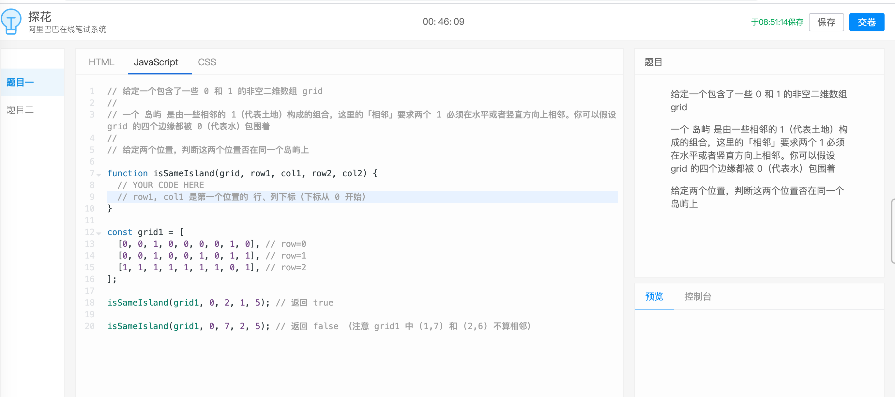
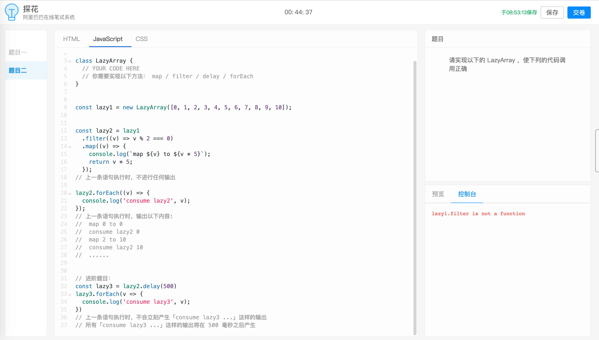
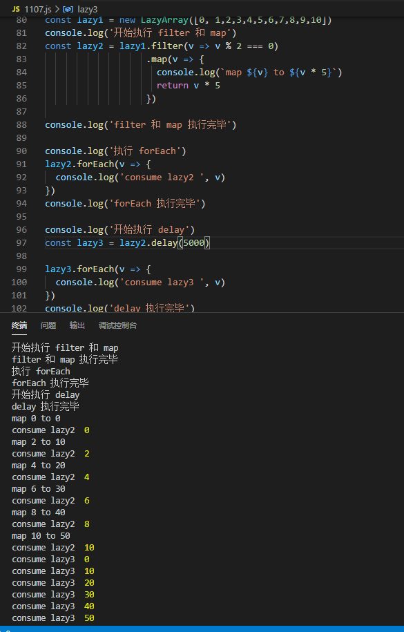

# 2020阿里前端算法题
---
*2020/11/07*

## 前言

::: tip
  学习群里优秀的小伙伴拿到阿里面试邀请，分享了两道算法题，自己也来尝试尝试。题目如下：

  

  
:::

## isSameIsalnd

::: tip
  思考：最初我的想法是先把二维数组 grid 中的所有岛屿找出来，保存在一个 map 上，岛屿名字为键(随便起，不重复即可)，这个岛的所有节点组成的数组为对应的值，再遍历 map 的键值对，判断是否同时包含两个节点。原理上应该是可行的，但是要遍历 grid 多次，效率可能不太好，于是就放弃了。

  判断两个点是否在同一个岛上，那我能不能从第一个点作为起点，开始往四周找到达第二个点的路，如果能找到就在同一个岛上，如果找不到就不在同一个岛，这样我只需要遍历一个岛的节点就行，效率应该是最高的。遍历岛节点这里用深度优先遍历，注意结束递归的条件。

  **为什么可以用深度遍历：**，比如初始给的 grid 如下：

```js
const grid1 = [
  [0, 0, 1, 0, 0, 0, 0, 1, 0],
  [0, 0, 1, 0, 0, 1, 0, 1, 1],
  [1, 1, 1, 1, 1, 1, 1, 0, 1]
]
```

  假设要判断 grid[0][2] 和 grid[2][2] 是否在同一个岛上，那么我们可以确定如果 grid[1][2] 和 grid[2][2] 在同一个岛，那么 grid[0][2] 和 grid[2][2] 必然也在同一个岛上，即 如果 A === B 且 B === C，那么 A === C


  代码如下：
```js
const isSameIsland = (grid, n1, n2, n3, n4) => {
  const rowLength = grid.length,
        columnLength = grid[0].length

  // 已经到达目标位置
  if(n1 === n3 && n2 === n4) {
    return true
  }
  
  // 已经到了二维数组边界，还不是目标节点，直接返回，没必要再往下了
  if(n1 < 0 || n1 >= rowLength || n2 < 0 || n2 >= columnLength) {
    return false
  }

  // 增加一个该节点是否访问过的标识
  if(grid[n1][n2] === 3) { // 3表示已访问过
    return false
  }

  // 0 代表海水，返回 false
  if(grid[n1][n2] === 0) {
    return false
  }

  grid[n1][n2] = 3 // 3表示已访问过
  // 分别向四周继续往下找，有任意一条路知道即成功
  return isSameIsland(grid, n1 - 1, n2, n3, n4) ||
         isSameIsland(grid, n1 + 1, n2, n3, n4) ||
         isSameIsland(grid, n1, n2 - 1, n3, n4) ||
         isSameIsland(grid, n1, n2 + 1, n3, n4)
}
```
:::

## LazyArray

::: tip
  思考：**延迟执行**，立马想到了 DOM 操作中的 ele.getElementsByClassName() 等返回相关元素节点列表的方法，C# 中的 LINQ 查询也类似，都是延迟执行，即查询操作不会立即执行，而要等到真正需要使用返回的列表元素时才去查询。

  这里 LazyArray 稍微改了下，延迟执行的查询变成 filter 和 map 方法，触发执行的方法为 forEach，要让函数延迟执行，即要保存函数之前执行的调用栈信息，马上想到了 Promise 有这个功能，和这篇文章中的用法类似 [Promise 巧妙解决refresh_token多次刷新的问题](https://mp.weixin.qq.com/s?__biz=MzIwNjc5ODA1Mw==&mid=2247484094&idx=1&sn=a39d5b16f674bc5b41a23ed322dee230&chksm=971d6f34a06ae6220e11378a41b2a22247551b47fca62d753559f926ffb8a0c3c2ca7effd629&token=181237259&lang=zh_CN#rd)，一些实现细节可以看看代码中的注释，代码如下：

```js
class LazyArray {
  constructor(array, delayTime = 0) { // delayTime 是为 delay() 方法准备的
  // 备份传入的数组，这道题里用不上
    this.array = array.slice() 
    // 这里为什么不和 this.array 一样也用备份值，也是为 delay() 方法准备的
    // delay 方法返回一个 LazyArray，我们要保证当前一个 LazyArray 中的值修改过后，
    // delay 方法返回的 LazyArray 数据也同步改变，即他们真正指向的是同一个内存地址
    this.tempArray = array 
    this.delayTime = delayTime
    // 缓存三个回调，filter 回调本题用不上，不说
    this.filterCallback = null
    // 在打印输出的时候有一个细节，即每个元素执行完 map 回调之后紧接着执行 forEach 回调
    // 如果不缓存起来会导致先打印 map 回调中的所有信息，再打印 forEach 回调中的所有信息，而不是交叉式的打印
    this.forEachCallback = null
    this.mapCallback = null
    // 通过 this.promise 保存 filter() 和 map() 的执行栈
    // 当 forEach 被调用时， 执行 this.resolve() 方法，恢复 filter() 和 map() 的执行
    this.promise = new Promise((resolve, reject) => {
      this.resolve = resolve
    })
  }

  filter = callback => {
    this.filterCallback = callback
    this.promise.then(() => {
      // 当 this.resolve() 被调用，恢复执行如下代码，即真正去修改 this.tempArray 中的数据
      const temp = this.tempArray.slice()
      this.tempArray.length = 0 // 全程保证 this.tempArray 的引用地址不变
      const arr = temp.filter(this.filterCallback)
      arr.forEach(v => this.tempArray.push(v))
    })
    // 返回 this，支持链式调用实例其他方法
    return this
  }

  map = callback => {
    this.mapCallback = callback
    this.promise.then(() => {
      // 当 this.resolve() 被调用，恢复执行如下代码，即真正去修改 this.tempArray 中的数据
      const temp = this.tempArray.slice()
      this.tempArray.length = 0
      const arr = temp.map(this.mapCallback)
      arr.forEach(v => this.tempArray.push(v))
    })

    return this
  }

  forEach = callback => {
    if(this.delayTime > 0) {
      // 说明该对象是调用 delay() 方法返回的 LazyArray，到达时间后再执行forEach 回调
      setTimeout(() => {
        this.doForEach(callback)
      }, this.delayTime)
    } else {
      this.doForEach(callback)
    }
  }

  doForEach = callback => {
    if(this.delayTime > 0) {
      // 这里直接调用两个 LazyArray 实例的相同对象 tempArrray 去执行，
      // 而不会触发上一个实例的 filter() 和 map() 去修改 tempArray 数组
      // 题目没这方面的要求，暂不考虑
      this.tempArray.forEach(callback)
    } else {
      this.forEachCallback = callback
      let mapCb = this.mapCallback
      // 修改 this.mapCallback 回调，保证一个元素执行完 map 回调之后接着执行 forEach 回调
      // 如果 filter 回调中也有一个打印呢，会是怎样？ 会先打印 filter 回调中的所有信息
      // 能不能把 filter 回调打印也和map、forEach一样是交叉的，即 [filter,map,forEach]、[filter,map,forEach]
      // 用目前这种实现方式是不行的，因为 filter 和 map 都需要返回值，而一个方法只有一个返回值，题目也没这个要求，不管它
      this.mapCallback = v => {
        const result = mapCb(v)
        this.forEachCallback(v)

        return result
      }

      this.resolve()
    } 
  }

  delay = time => {
    return new LazyArray(this.tempArray, time)
  }
}
```

  小伙伴面试回来说 delay 方法理解有误，不是延迟多少时间后一次性输出所有，而是一个一个延迟指定秒数输出，那在deForEach 方法中，不在一开始对 this.delayTime 做判断，即取消第一个if，把这个判断放在重新实现的 this.mapCallback 方法内，如下（一个思路而已）：

```js
this.mapCallback = v => {
  if(this.delayTime > 0) {
    const now = new Date()
    while(new Date() - now < this.delayTime) {
      // 阻塞当前线程，直到 this.delayTime，再放行
    }
  }
  const result = mapCb(v)
  this.forEachCallback(v)

  return result
}
```

  

  [回首页](/algorithm)
:::

（完）