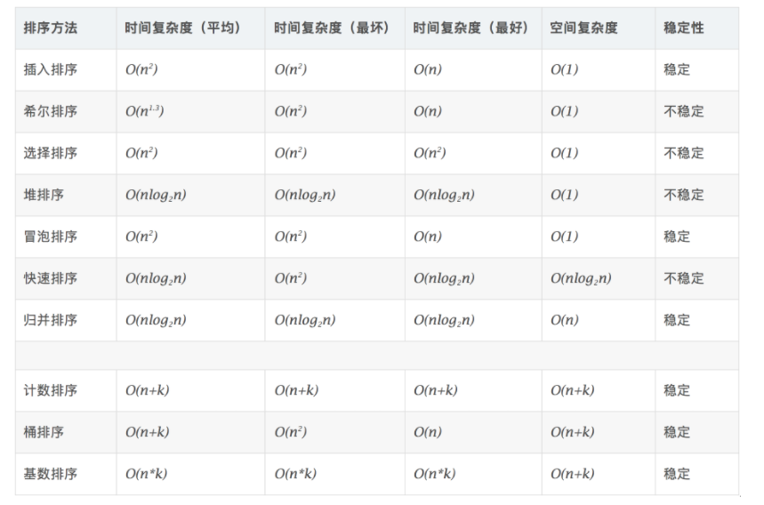
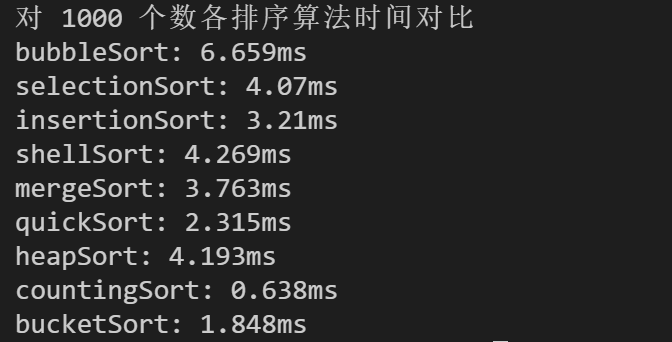
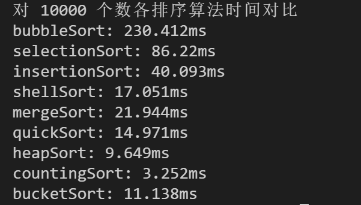
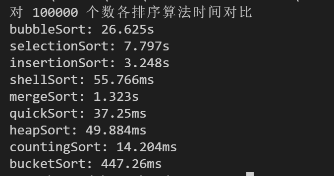
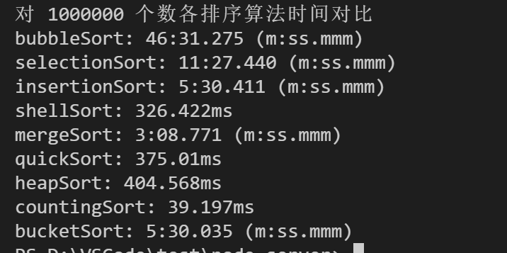

# 一次性看完十种排序算法
---
*2020/11/09*

## 前言

::: tip
  先说说排序中的几个常见概念吧。

  **比较排序：** 通过比较来决定元素间的相对次序，由于其时间复杂度不能突破 O(nlogn)，因此也成为非线性时间比较排序，主要有

* 交换排序
  * 冒泡排序
  * 快速排序
* 插入排序
  * 简单插入排序
  * 希尔排序
* 选择排序
  * 简单选择排序
  * 堆排序
* 归并排序
  * 二路归并排序
  * 多路归并排序

**非比较排序：** 不通过比较来决定元素间的相对次序，它可以突破基于比较排序的时间下界，以线性时间运行，因此也称为线性时间非比较类排序，主要有

* 计数排序
* 桶排序
* 基数排序

  再看看这些算法各有什么特点，如下图：

  

  时间复杂度空间复杂度不解释了，解释下稳定和不稳定：

* **稳定：** 如果 a 原本在 b 前面，而 a=b，排序之后仍然在 b 前面。
* **不稳定：** 如果 a 原本在 b 前面，而 a=b，排序之后 a 可能出现在 b 的后面。

  下面逐个看看这些算法。
:::

## 1. 冒泡排序

### 概念

::: tip
  冒泡排序（Bubble-sort）是一种简单的排序算法。它重复地走访过要排序的数列，一次比较两个元素，如果它们的顺序错误就把它们交换过来。走访数列的工作是重复地进行直到没有再需要交换，也就是说该数列已经排序完成。这个算法的名字由来是因为越小的元素会经由交换慢慢“浮”到数列的顶端。
:::

### 算法描述

::: tip
* 比较相邻的元素。如果第一个比第二个大，就交换它们两个；
* 对每一对相邻元素作同样的工作，从开始第一对到结尾的最后一对，这样在最后的元素应该会是最大的数；
* 针对所有的元素重复以上的步骤，除了最后一个；
* 重复步骤1~3，直到排序完成。
:::

### 动图演示


### 代码实现

::: tip
```js
const bubbleSort = arr => {
  const len = arr.length

  let temp
  for(let i = 0; i < len - 1; i++) {
    for(let j = 0; j < len - 1 - i; j++) {
      if(arr[j] > arr[j + 1]) {
        temp = arr[j + 1]
        arr[j + 1] = arr[j]
        arr[j] = temp
      }
    }
  }

  return arr
}
```
:::

## 2. 选择排序

### 概念

::: tip
  选择排序(Selection-sort)是一种简单直观的排序算法。它的工作原理：首先在未排序序列中找到最小（大）元素，存放到排序序列的起始位置，然后，再从剩余未排序元素中继续寻找最小（大）元素，然后放到已排序序列的末尾。以此类推，直到所有元素均排序完毕。
:::

### 算法描述

::: tip
  n个记录的直接选择排序可经过n-1趟直接选择排序得到有序结果。具体算法描述如下：
* 初始状态：无序区为R[1..n]，有序区为空；
* 第i趟排序(i=1,2,3…n-1)开始时，当前有序区和无序区分别为R[1..i-1]和R(i..n）。该趟排序从当前无序区中-选出关键字最小的记录 R[k]，将它与无序区的第1个记录R交换，使R[1..i]和R[i+1..n)分别变为记录个数增加1个的新有序区和记录个数减少1个的新无序区；
* n-1趟结束，数组有序化了。
:::

### 动图演示


### 代码实现

::: tip
``` js
const selectionSort = arr => {
  const len = arr.length
  let minIndex, temp

  for(i = 0; i < len - 1; i++) {
    minIndex = i // 假设第 i 个元素最小
    for(let j  = i + 1; j < len; j++) {
      if(arr[j] < arr[minIndex]) { // 当前元素 j 和最小元素 i 比较
        minIndex = j // 替换 j 为最小元素
      }
    }
    // 交换 i 和 最小元素 minIndex 的位置
    temp = arr[i]
    arr[i] = arr[minIndex]
    arr[minIndex] = temp
  }

  return arr
}
```
:::

### 算法分析

::: tip
  表现最稳定的排序算法之一，因为无论什么数据进去都是O(n2)的时间复杂度，所以用到它的时候，数据规模越小越好。唯一的好处可能就是不占用额外的内存空间了吧。理论上讲，选择排序可能也是平时排序一般人想到的最多的排序方法了吧。
:::

## 3. 插入排序

### 概念

::: tip
  插入排序（Insertion-Sort）的算法描述是一种简单直观的排序算法。它的工作原理是通过构建有序序列，对于未排序数据，在已排序序列中从后向前扫描，找到相应位置并插入。
:::

### 算法描述

::: tip
  一般来说，插入排序都采用in-place在数组上实现。具体算法描述如下：

* 从第一个元素开始，该元素可以认为已经被排序；
* 取出下一个元素，在已经排序的元素序列中从后向前扫描；
* 如果该元素（已排序）大于新元素，将该元素移到下一位置；
* 重复步骤3，直到找到已排序的元素小于或者等于新元素的位置；
* 将新元素插入到该位置后；
* 重复步骤2~5。
:::

### 动图演示


### 代码实现 

::: tip
```js
const insertionSort = arr => {
  const len = arr.length
  let preIndex, current

  for(let i = 1; i < len; i++) {
    preIndex = i - 1
    current = arr[i]

    while (preIndex >= 0 && arr[preIndex] > current) {
      // 当前元素比前一个元素小，前一个元素后移一位
      arr[preIndex + 1] = arr[preIndex]
      preIndex--
    }

    arr[preIndex + 1] = current
  }

  return arr
}
```
:::

### 算法分析

::: tip
  插入排序在实现上，通常采用in-place排序（即只需用到O(1)的额外空间的排序），因而在从后向前扫描过程中，需要反复把已排序元素逐步向后挪位，为最新元素提供插入空间。
:::

## 4. 希尔排序

### 概念

::: tip
  1959年Shell发明，第一个突破O(n2)的排序算法，是简单插入排序的改进版。它与插入排序的不同之处在于，它会优先比较距离较远的元素。希尔排序又叫缩小增量排序。
:::

### 算法描述

::: tip
  先将整个待排序的记录序列分割成为若干子序列分别进行直接插入排序，具体算法描述：

* 选择一个增量序列t1，t2，…，tk，其中ti>tj，tk=1；
* 按增量序列个数k，对序列进行k 趟排序；
* 每趟排序，根据对应的增量ti，将待排序列分割成若干长度为m 的子序列，分别对各子表进行直接插入排序。仅增量因子为1 时，整个序列作为一个表来处理，表长度即为整个序列的长度。
:::

### 动图演示


### 代码实现

::: tip
```js
const shellSort = arr => {
  const len = arr.length

  for(let gap = Math.floor(len / 2); gap > 0; gap = Math.floor(gap / 2)) {
    for(let i = gap; i < len; i++) {
      let j = i
      let current = arr[i]
      while(j - gap >= 0 && current < arr[j - gap]) {
        arr[j] = arr[j - gap]
        j = j - gap
      }

      arr[j] = current
    }
  }

  return arr
}
```
:::

### 算法分析

::: tip
  希尔排序的核心在于间隔序列的设定。既可以提前设定好间隔序列，也可以动态的定义间隔序列。动态定义间隔序列的算法是《算法（第4版）》的合著者Robert Sedgewick提出的。
:::

## 5. 归并排序

### 概念

::: tip
  归并排序是建立在归并操作上的一种有效的排序算法。该算法是采用分治法（Divide and Conquer）的一个非常典型的应用。将已有序的子序列合并，得到完全有序的序列；即先使每个子序列有序，再使子序列段间有序。若将两个有序表合并成一个有序表，称为2-路归并。
:::

### 算法描述

::: tip
* 把长度为n的输入序列分成两个长度为n/2的子序列；
* 对这两个子序列分别采用归并排序；
* 将两个排序好的子序列合并成一个最终的排序序列。
:::

### 动图演示


### 代码实现

::: tip
```js
const merge = (left, right) => {
  const result = []
  // 左右两个数组都是已排好序的了，直接从头对比即可
  while(left.length > 0 && right.length > 0) {
    if(left[0] <= right[0]) {
      result.push(left.shift())
    } else {
      result.push(right.shift())
    }
  }
  while(left.length) {
    result.push(left.shift())
  }
  while(right.length) {
    result.push(right.shift())
  }

  return result
}

const mergeSort = arr => {
  const len = arr.length
  if(len < 2) {
    return arr
  }
  const middle = Math.floor(len / 2),
        left = arr.slice(0, middle), // 将原数组中间分割成两个数组
        right = arr.slice(middle)
  // 合并排好序的左右两个数组
  return merge(mergeSort(left), mergeSort(right))
}
```
:::

### 算法分析

::: tip
  归并排序是一种稳定的排序方法。和选择排序一样，归并排序的性能不受输入数据的影响，但表现比选择排序好的多，因为始终都是O(nlogn）的时间复杂度。代价是需要额外的内存空间。
:::

## 6. 快速排序

### 概念

::: tip
  快速排序的基本思想：通过一趟排序将待排记录分隔成独立的两部分，其中一部分记录的关键字均比另一部分的关键字小，则可分别对这两部分记录继续进行排序，以达到整个序列有序。
:::

### 算法描述

::: tip
  快速排序使用分治法来把一个串（list）分为两个子串（sub-lists）。具体算法描述如下：

* 从数列中挑出一个元素，称为 “基准”（pivot）；
* 重新排序数列，所有元素比基准值小的摆放在基准前面，所有元素比基准值大的摆在基准的后面（相同的数可以到任一边）。在这个分区退出之后，该基准就处于数列的中间位置。这个称为分区（partition）操作；
* 递归地（recursive）把小于基准值元素的子数列和大于基准值元素的子数列排序。
:::

### 动图演示


### 代码实现

::: tip
```js
const swap = (arr, i, j) => {
  const temp = arr[i]
  arr[i] = arr[j]
  arr[j] = temp
}

const partition = (arr, left, right) => {
  // 选取左边第一个元素作为基准值,
  // 即 每次返回的 partitionIndex 是左边第一个元素排序后的正确位置
  const pivot = left 
  let index = pivot + 1
  
  for(let i = index; i <= right; i++) {
    if(arr[i] < arr[pivot]) {
      swap(arr, i, index)
      index++
    }
  }
  swap(arr, pivot, index - 1)

  return index - 1
}

const quickSort = (arr, left = 0, right = arr.length - 1) => {
  const len = arr.length
  let partitionIndex
      
  if(left < right) {
    // 经过 partition 函数后，partitionIndex 位置的元素已排好序
    // 即 函数后，partitionIndex 左边的元素都比它小，右边的元素都比它大
    partitionIndex = partition(arr, left, right) 
    quickSort(arr, left, partitionIndex - 1)
    quickSort(arr, partitionIndex + 1, right)
  }

  return arr
}
```
:::

## 7. 堆排序

### 概念

::: tip
  堆排序（Heapsort）是指利用堆这种数据结构所设计的一种排序算法。堆积是一个近似完全二叉树的结构，并同时满足堆积的性质：即子结点的键值或索引总是小于（或者大于）它的父节点。
:::

### 算法描述

::: tip
* 将初始待排序关键字序列(R1,R2….Rn)构建成大顶堆，此堆为初始的无序区；
* 将堆顶元素R[1]与最后一个元素R[n]交换，此时得到新的无序区(R1,R2,……Rn-1)和新的有序区(Rn),且满足R[1,2…n-1]<=R[n]；
* 由于交换后新的堆顶R[1]可能违反堆的性质，因此需要对当前无序区(R1,R2,……Rn-1)调整为新堆，然后再次将R[1]与无序区最后一个元素交换，得到新的无序区(R1,R2….Rn-2)和新的有序区(Rn-1,Rn)。不断重复此过程直到有序区的元素个数为n-1，则整个排序过程完成。
:::

### 动图演示


### 代码实现

::: tip
```js
let len
const swap = (arr, i, j) => {
  const temp = arr[i]
  arr[i] = arr[j]
  arr[j] = temp
}
const heapify = (arr, i) => { // 堆调整
  const left = 2 * i + 1,
        right = 2 * i + 2
  let largest = i

  if(left < len && arr[left] > arr[largest]) {
    largest = left
  }

  if(right < len && arr[right] > arr[largest]) {
    largest = right
  }

  if(largest !== i) {
    swap(arr, i, largest)
    heapify(arr, largest)
  }
}
const buildMaxHeap = arr => { // 建立大顶堆
  len = arr.length
  for(let i = Math.floor(len / 2); i >= 0; i--) {
    heapify(arr, i)
  }
}

const heapSort = arr => {
  buildMaxHeap(arr)

  for(let i = arr.length - 1; i > 0; i--) {
    swap(arr, 0, i)
    len--
    heapify(arr, 0)
  }

  return arr
}
```
:::

## 8. 计数排序

### 概念

::: tip
  计数排序不是基于比较的排序算法，其核心在于将输入的数据值转化为键存储在额外开辟的数组空间中。 作为一种线性时间复杂度的排序，计数排序要求输入的数据必须是有确定范围的整数。
:::

### 算法描述

::: tip
* 找出待排序的数组中最大和最小的元素；
* 统计数组中每个值为i的元素出现的次数，存入数组C的第i项；
* 对所有的计数累加（从C中的第一个元素开始，每一项和前一项相加）；
* 反向填充目标数组：将每个元素i放在新数组的第C(i)项，每放一个元素就将C(i)减去1。
:::

### 动图演示


### 代码实现

::: tip
```js
const countingSort = (arr, maxValue) => { // maxValue 待排序数组中的最大值
  const bucket = [],
        arrLen = arr.length,
        bucketLen = maxValue + 1
  let sortedIndex = 0

  for(let i = 0; i < arrLen; i++) {
    if(!bucket[arr[i]]) {
      bucket[arr[i]] = 0
    }
    // 在 bucket 数组中记录 arr[i] 出现的次数，bucket 的索引就是 arr[i] 对应的值
    bucket[arr[i]]++
  }

  for(let j = 0; j < bucketLen; j++) {
    while(bucket[j] > 0) {
      arr[sortedIndex++] = j
      bucket[j]--
    }
  }

  return arr
}
```
:::

### 算法分析

::: tip
  计数排序是一个稳定的排序算法。当输入的元素是 n 个 0到 k 之间的整数时，时间复杂度是O(n+k)，空间复杂度也是O(n+k)，其排序速度快于任何比较排序算法。当k不是很大并且序列比较集中时，计数排序是一个很有效的排序算法。
:::

## 9. 桶排序

### 概念

::: tip
  桶排序是计数排序的升级版。它利用了函数的映射关系，高效与否的关键就在于这个映射函数的确定。桶排序 (Bucket sort)的工作的原理：假设输入数据服从均匀分布，将数据分到有限数量的桶里，每个桶再分别排序（有可能再使用别的排序算法或是以递归方式继续使用桶排序进行排）。
:::

### 算法描述

::: tip
* 设置一个定量的数组当作空桶；
* 遍历输入数据，并且把数据一个一个放到对应的桶里去；
* 对每个不是空的桶进行排序；
* 从不是空的桶里把排好序的数据拼接起来。 
:::

### 图片演示


### 代码实现

::: tip
```js
const bucketSort = (arr, bucketSize) => {
  if(arr.length === 0) {
    return arr
  }

  let i
  let minValue = arr[0]
  let maxValue = arr[0]
  const arrLength = arr.length
  for( i = 1; i < arrLength; i++) {
    if(arr[i] < minValue) {
      minValue = arr[i] // 保存数组最小值
    } else if(arr[i] > maxValue){
      maxValue = arr[i] // 保存数组最大值
    }
  }

  // 桶的初始化
  const DEFAULT_BUCKET_SIZE = 5 // 设置桶的默认数量
  bucketSize = bucketSize || DEFAULT_BUCKET_SIZE
  const bucketCount = Math.floor((maxValue - minValue) / bucketSize) + 1
  const buckets = []
  for(i = 0; i < bucketCount; i++) {
    buckets.push([])
  }

  // 利用映射函数将数据分配到各个桶中
  for(i = 0; i < arrLength; i++) {
    buckets[Math.floor((arr[i] - minValue) / bucketSize)].push(arr[i])
  }
  arr.length = 0
  for(i = 0; i < buckets.length; i++) {
    // 对每个桶进行排序，可以设置好桶的数量，不进行递归调用，这里用插入排序
    insertionSort(buckets[i])
    for(let j = 0; j < buckets[i].length; j++) {
      arr.push(buckets[i][j])
    }
  }

  return arr
}
```
:::

### 算法分析

::: tip
  桶排序最好情况下使用线性时间O(n)，桶排序的时间复杂度，取决与对各个桶之间数据进行排序的时间复杂度，因为其它部分的时间复杂度都为O(n)。很显然，桶划分的越小，各个桶之间的数据越少，排序所用的时间也会越少。但相应的空间消耗就会增大。
:::

## 10. 基数排序

### 概念

::: tip
  基数排序是按照低位先排序，然后收集；再按照高位排序，然后再收集；依次类推，直到最高位。有时候有些属性是有优先级顺序的，先按低优先级排序，再按高优先级排序。最后的次序就是高优先级高的在前，高优先级相同的低优先级高的在前。
:::

### 算法描述

::: tip
* 取得数组中的最大数，并取得位数；
* arr为原始数组，从最低位开始取每个位组成radix数组；
* 对radix进行计数排序（利用计数排序适用于小范围数的特点）；
:::

### 动图演示


### 代码实现

::: tip
```js
const counter = []
const radixSort = (arr, maxDigit) => {
  let mod = 10
  let dev = 1
  for(let i = 0; i < maxDigit; i++, dev *= 10, mod *= 10) {
    for(let j = 0; j < arr.length; j++) {
      const bucket = parseInt((arr[j] % mod) / dev)
      if(!counter[bucket]) {
        counter[bucket] = []
      }
      counter[bucket].push(arr[j])
    }
    let pos = 0
    for(let j = 0; j < counter.length; j++) {
      let value = null
      if(counter[j]) {
        while((value = counter[j].shift())) {
          arr[pos++] = value
        }
      }
    }
  }

  return arr
}
```
:::

### 算法分析

::: tip
  基数排序基于分别排序，分别收集，所以是稳定的。但基数排序的性能比桶排序要略差，每一次关键字的桶分配都需要O(n)的时间复杂度，而且分配之后得到新的关键字序列又需要O(n)的时间复杂度。假如待排数据可以分为d个关键字，则基数排序的时间复杂度将是O(d*2n) ，当然d要远远小于n，因此基本上还是线性级别的。

  基数排序的空间复杂度为O(n+k)，其中k为桶的数量。一般来说n>>k，因此额外空间需要大概n个左右。
:::

## 各算法时间比对

::: tip
  由于基数排序的 maxDigit 参数选择对排序结果影响很大，所以此次比对不包含该算法，剩余9个算法结果如下：

  
  
  
  

  可以发现冒泡排序稳居最差，计数排序是最好的，但是它使用场景有限，桶排序也受第二个参数 bucketSize 影响较大。

  由[十大经典排序算法（动图演示）](https://www.cnblogs.com/onepixel/p/7674659.html)处转载

  [回首页](/algorithm)
:::

（完）