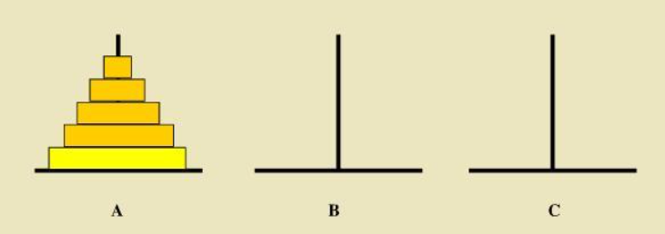
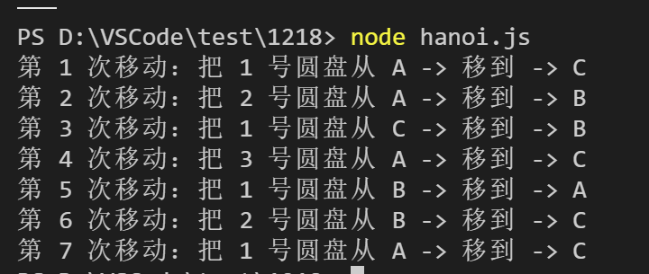

# 汉诺塔问题
---
*2020/12/19*

## 前言

::: tip
  汉诺塔（又称河内他）问题是源于印度一个古老传说的益智玩具。大梵天创造世界的时候做了三根金刚石柱子，在一根柱子上从下往上按照大小顺序摞着64片黄金圆盘。大梵天命令婆罗门把圆盘从下面开始按大小顺序重新摆放在另一根柱子上。并且规定，在小圆盘上不能放大圆盘，在三根柱子之间一次只能移动一个圆盘。

  抽象为数学问题，如下图所示，从左到右有A、B、C三根柱子，其中A柱子上面有从小叠到大的n个圆盘，现要求将A柱子上的圆盘移到C柱子上去，期间只有一个原则：一次只能移到一个盘子且大盘子不能在小盘子上面，求移动的步骤和移动的次数。

  
:::

## 解法分析

::: tip
  假设只有一个圆盘 n==1，移动一次即可， A--->C

  假设有两个圆盘 n==2，共3次
  * 第一次：1号盘 A--->B
  * 第二次：2号盘 A--->C
  * 第三次：3好盘 B--->C

  假设有三个圆盘 n==3，共7次
  * 第一次：1号盘 A--->C
  * 第二次：2号盘 A--->B
  * 第三次：1号盘 C--->B
  * 第四次：3号盘 A--->C
  * 第五次：1号盘 B--->A
  * 第六次：2号盘 B--->C
  * 第七次：1号盘 A--->C

  不难发现移动次数为： 2^n - 1。

  这里 **小盘子只能放在大盘子上面** 这个要求和数据结构 **栈** 有点类似，栈要求先进后出，再想到函数递归调用栈，可能会用到递归。

  `把大象装进冰箱需要几步？`，答：三步，打开冰箱门，把大象装进冰箱，关上冰箱门。

  这里也采取类似的做法，分三步：
  * 把 n-1 个盘子由 A 移到 B
  * 把第 n 个盘子由 A 移到 C
  * 把 n-1 个盘子由 B 移到 C
:::

## 代码实现

::: tip
``` js
let m = 0

const move = (disks, N, M) => {
  console.log(`第 ${++m} 次移动：把 ${disks} 号圆盘从 ${N} -> 移到 -> ${M}`)
}

const hanoi = (n, A, B, C) => {
  if(n === 1) { // 只有一个时，直接从 A塔 移到 C塔
    move(1, A, C)
  } else {
    hanoi(n - 1, A, C, B) // 递归，把 A塔上编号 1 ~ n-1 的圆盘移到 B塔 上，C塔为辅助塔
    move(n, A, C) // 把 A塔编号为 n 的圆盘移到 C塔上
    hanoi(n - 1, B, A, C) // 递归，把 B塔上编号为 1 ~ n-1 的圆盘移动到 C塔上，A塔为辅助塔
  }
}

hanoi(3, 'A', 'B', 'C')
```

  结果如下：

  

  [回首页](/algorithm)
:::

（完）