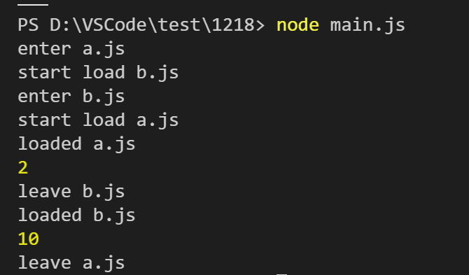
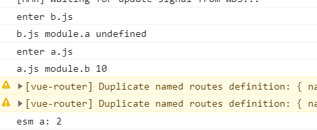

# CommonJS 和 ESM 中的循环依赖
---
*2020/12/18*

## 前言

::: tip
  近些年前端也模块化了，实现模块化就涉及依赖外部模块，由此必然会引入循环依赖的问题，a 依赖 b、b 依赖 a，今天就看看 `CommonJS` 和 `ES Module` 各自是怎么处理循环依赖的。
:::

## CommonJS

::: tip
  首先需要理解 `CommonJS` 的模块加载机制，可参考 [Node 模块加载机制](./cjs.html)，简单的说就是系统会把文件内容包裹在一个函数内，并给这个函数提供 **module**、**exports** 等一些入参，也就是说它的加载过程是同步的。下面看一个例子：
:::

### 示例

::: tip
``` js
// a.js
console.log('enter a.js')
exports.a = 2
console.log('start load b.js')
const moduleb = require('./b.js')
console.log('loaded b.js')
console.log(moduleb.b)
exports.a = 8
console.log('leave a.js')
```

``` js
// b.js
console.log('enter b.js')
exports.b = 1
console.log('start load a.js')
const modulea = require('./a.js')
console.log('loaded a.js')
console.log(modulea.a)
exports.b = 10
console.log('leave b.js')
```

``` js
// main.js
require('./a.js')

// 命令行执行  node main.js
```

  输出结果如下：

  
:::

### 结果分析

::: tip
  根据代码执行顺序再走一遍就能清楚 `CommonJS` 是怎么处理循环引用的了，首先 main.js 文件加载 a.js，进入 a.js 文件，输出 `enter a.js`，此时 `模块a.js` 导出的 **a** 属性值为2，然后去加载 b.js，进入 b.js 文件，输出 `enter b.js`，此时 `模块b.js` 导出的 **b** 属性值为1，然后又去加载 a.js，因为 a.js 模块已经被 main.js 加载过一次了，即全局缓存内已经存在一个 `模块a.js` 文件对应的一个对象，只不过这个对象的 `loaded` 属性为 `false`，即还未完全加载完毕，但是 `模块a.js` 导出的 **a** 属性已经挂载到该对象上了，只不过a属性的值仍然为2。所以 `模块b.js` 中获取到的 `modulea.a` 的值为 2，然后将 `模块b.js` 导出的 **b** 属性值修改为 10，随后 b.js 文件加载完毕，即该模块生成对象的 `loaded` 属性设置为 `true`。然后回到 a.js 继续执行输出 `loaded b.js`，此时 `moduleb.b` 的值为10，随后 `模块a.js` 导出的 **a** 属性值修改为 8，`模块a.js` 加载完毕，模块对应对象的 `loaded` 属性值变成 `true`。a.js、b.js文件模块都加载完毕。

  可以发现 `CommonJS` 的循环依赖解析走的是深度优先。
:::

## ES Module

::: tip
  `ES Module` 引入和 `CommonJS` 的引入是不一样的，`ES Module` 导出的是一个引用地址，即该模块被导入后，它们指向的是同一份内存地址，也是看一个例子：
:::

### 示例

::: tip
``` js
// a.js
console.log('enter a.js')
import { b } from './b.js'
console.log(`a.js module.b ${b}`)

export let a = 2
```

``` js
// b.js
console.log('enter b.js')
import { a } from './a.js'
console.log(`b.js module.a ${a}`)

export let b = 10
```

``` js
// main.js
import { a } from './a.js'

console.log(`esm a: ${a}`)
```

  输出结果如下：

  
:::

### 结果分析

::: tip
  首先js引擎如果检查到文件内有 import/export 关键字，则会认为你使用的是 `ES Module`，然后将 `import` 关键字提升到文件最前面，这就导致了 `enter a.js` 不是最先输出的。`模块 b.js` 去加载 `模块 a.js`时，发现它还没有被标记为解析完毕，所以此时 `模块 a.js` 导出的 **a** 是 `undefined` 。解析完 `模块 b.js` 之后再继续解析 `模块 a.js`，所以在 a.js 文件中能顺利的获取到 b.js文件导出的 b。

  从这里可以看出 `ES Module` 依赖也是遵循深度优先去解析依赖，但是它会比 `CommonJS` 简单一些，首先将所有 `import` 关键字的外部依赖移动到文件头部，先去加载外部依赖，此时该模块标记为 `fetching`，如果外部模块又依赖该模块时，在同步情况下是获取不到的，但是在异步情况下是可以获取到，即在 a.js 文件解析完毕之后，依赖的值会更新。如下修改 b.js：

``` js
console.log('enter b.js')
import { a } from './a.js'
console.log(`b.js module.a ${a}`) // undefined

setTimeout(() => {
  console.log(`setTimeout b.js module.a ${a}`) // 2
}, 1000);

export let b = 10
```

  [回首页](/frontend)
:::

（完）