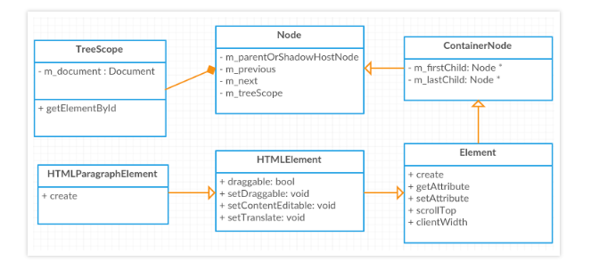
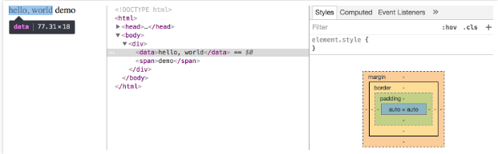
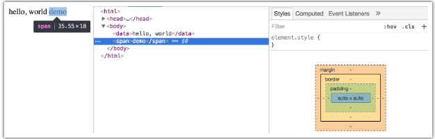

# Chrome浏览器 DOM 树构建过程
---
*2020/11/01*

## 前言

::: tip
  近日看到**会编程的银猪**大神写的 [从Chrome源码看浏览器如何构建DOM树](https://www.rrfed.com/2017/01/30/chrome-build-dom/)，感觉写的非常精彩，他把 Chrome 浏览器源码下载到本地，采用debug模式，来看DOM树生成过程，我这属于对这篇文章的一个总结。
:::

## DOM 对象结构

::: tip
  Chrome源码是 **C++** 写的，先看看构建 DOM 对象的几个关键类的 UML 图：

  

  **Node** 对象是所有 DOM 元素的父类，它有几个属性，分别指向父节点和前后兄弟节点，后面几个子类各自扩展了一些属性。
:::

## 构建 DOM 树

### 启动 DocumentLoader

::: tip
  当在浏览器地址栏输入一个网址，浏览器用网络进程发起请求，服务器返回一串字符串，通过Chrome内核Blink封装的IPC进程间通信，触发DocumentLoader的dataReceived函数，里面会去调它的commitData函数，开始具体业务处理，为方便阅读，我们把字符串内容格式化下，如下：

``` html
<!DOCTYPE html>
<html>
<head>
    <meta charset="utf-8">
</head>
<body>
    <div>
        <h1 class="title">demo</h1>
        <input value="hello">
    </div>
</body>
</html>
```

``` c
void DocumentLoader::commitData(const char* bytes, size_t length) {
  ensureWriter(m_response.mimeType());
 
  if (length)
    m_dataReceived = true;
 
  m_writer->addData(bytes, length);
}

void DocumentLoader::ensureWriter(const AtomicString& mimeType,
                                  const KURL& overridingURL) {
  if (m_writer) // 确保Parser和document只会初始化一次
    return;
}
```

  HTMLDocumentParser 类会负责将这些 html 文本解析为 **tokens**，一个 token 就是一个标签文本的描述，并借助HTMLTreeBuilder 对这些tokens分类处理，根据不用的标签类型、在文档不同位置，调用HTMLConstructionSite不同的函数构建DOM树。在构建过程中建立起它们的父子兄弟关系，其中它有一个 m_document 成员变量，指向这棵树的根节点，即 window.document。
:::

### 生成 tokens

::: tip
  我们直接看下上面那串字符串生成对应的tokens的一些关键信息，其实也有点类似 **AST**：

``` js
tagName: html  |type: DOCTYPE   |attr:              |text: "
tagName:       |type: Character |attr:              |text: \n"
tagName: html  |type: startTag  |attr:              |text: "
tagName:       |type: Character |attr:              |text: \n"
tagName: head  |type: startTag  |attr:              |text: "
tagName:       |type: Character |attr:              |text: \n    "
tagName: meta  |type: startTag  |attr:charset=utf-8 |text: "
tagName:       |type: Character |attr:              |text: \n"
tagName: head  |type: EndTag    |attr:              |text: "
tagName:       |type: Character |attr:              |text: \n"
tagName: body  |type: startTag  |attr:              |text: "
tagName:       |type: Character |attr:              |text: \n    "
tagName: div   |type: startTag  |attr:              |text: "
tagName:       |type: Character |attr:              |text: \n        "
tagName: h1    |type: startTag  |attr:class=title   |text: "
tagName:       |type: Character |attr:              |text: demo"
tagName: h1    |type: EndTag    |attr:              |text: "
tagName:       |type: Character |attr:              |text: \n        "
tagName: input |type: startTag  |attr:value=hello   |text: "
tagName:       |type: Character |attr:              |text: \n    "
tagName: div   |type: EndTag    |attr:              |text: "
tagName:       |type: Character |attr:              |text:     \n"
tagName: body  |type: EndTag    |attr:              |text: "
tagName:       |type: Character |attr:              |text: \n"
tagName: html  |type: EndTag    |attr:              |text: "
tagName:       |type: Character |attr:              |text: \n"
tagName:       |type: EndOfFile |attr:              |text: "
```

  可以看到 Parse 将服务端放回的html字符串信息解析得非常详细，包含标签名、类型、属性、innerText。Chrome总共定义了7种token标签类型：

``` js
enum TokenType {
  Uninitialized,
  DOCTYPE,
  StartTag,
  EndTag,
  Comment,
  Character,
  EndOfFile,
};
```
:::

### 处理 tokens 生成 DOM 树

::: tip
  tokens 生成以后，在HTMLDocumentParser::processTokenizedChunkFromBackgroundParser函数里遍历tokens，依次调用constructTreeFromCompactHTMLToken进行处理，它会对不同类型的节点做相应处理，从上往下一次是文本节点、doctype节点、开标签、闭标签等。

``` c
void HTMLTreeBuilder::processToken(AtomicHTMLToken* token) {
  if (token->type() == HTMLToken::Character) {
    processCharacter(token);
    return;
  }
 
  switch (token->type()) {
    case HTMLToken::DOCTYPE:
      processDoctypeToken(token);
      break;
    case HTMLToken::StartTag:
      processStartTag(token);
      break;
    case HTMLToken::EndTag:
      processEndTag(token);
      break;
    //othercode
  }
}
```
:::

#### DOCType 处理

::: tip
  DOCTYPE 类型token会调用processDoctypeToken函数，里面调了HTMLConstructionSite的插入doctype的函数：

``` c
void HTMLTreeBuilder::processDoctypeToken(AtomicHTMLToken* token) {
  m_tree.insertDoctype(token);
  setInsertionMode(BeforeHTMLMode);
}
```

  在这个函数里面，它会先创建一个doctype的结点，再创建插dom的task，并设置文档类型：

``` c
void HTMLConstructionSite::insertDoctype(AtomicHTMLToken* token) {
  //const String& publicId = ...
  //const String& systemId = ...
  DocumentType* doctype =
      DocumentType::create(m_document, token->name(), publicId, systemId); //创建DOCType结点
  attachLater(m_attachmentRoot, doctype);  //创建插DOM的task
  setCompatibilityModeFromDoctype(token->name(), publicId, systemId); //设置文档类型
}
```

  设置不同的doctype对文档类型设置有不同的影响，

``` c
// Check for Quirks Mode.
if (name != "html" ) {
  setCompatibilityMode(Document::QuirksMode);
  return;
}
```

  如果 tagName 不是html，那么文档类型将会是怪异模式或有限怪异模式：

``` c
// 怪异模式
<!DOCType svg>
<!DOCType math>

// 有限怪异模式
<!DOCTYPE HTML PUBLIC "-//W3C//DTD HTML 4.01 Transitional//EN"
"http://www.w3.org/TR/html4/loose.dtd">

// Check for Limited Quirks Mode.
if (!systemId.isEmpty() &&
      publicId.startsWith("-//W3C//DTD HTML 4.01 Transitional//",
                          TextCaseASCIIInsensitive))) {
  setCompatibilityMode(Document::LimitedQuirksMode);
  return;
}
```

  常用的html5的写法是标准模式，如果连DOCType声明也没有，那么会默认设置为怪异模式。各模式的区别源码注释如下：
:::

::: warning
``` js
// There are three possible compatibility modes:
// Quirks - quirks mode emulates WinIE and NS4. CSS parsing is also relaxed in
// this mode, e.g., unit types can be omitted from numbers.
// Limited Quirks - This mode is identical to no-quirks mode except for its
// treatment of line-height in the inline box model.
// No Quirks - no quirks apply. Web pages will obey the specifications to the
// letter.
```
  大意是说，怪异模式会模拟IE，同时CSS解析会比较宽松，例如数字单位可以省略，而有限怪异模式和标准模式的唯一区别在于在于对inline元素的行高处理不一样。标准模式将会让页面遵守文档规定。
:::

#### 开标签处理

::: tip
  下一个遇到的开标签是 <html\> 标签，处理这个标签的任务是实例化一个 HTMLHtmlElement 元素，然后把它的父元素指向document，同时，会把这个元素压到一个栈里面，这个栈存放了未遇到闭标签的所有开标签。

``` c
void HTMLConstructionSite::insertHTMLHtmlStartTagBeforeHTML(AtomicHTMLToken* token) {
  HTMLHtmlElement* element = HTMLHtmlElement::create(*m_document); // 实例化 HTMLHtmlElement
  attachLater(m_attachmentRoot, element); // 把element元素放到任务队列
  m_openElements.pushHTMLHtmlElement(HTMLStackItem::create(element, token)); // 开标签入栈
  executeQueuedTasks(); // 执行队列中的任务
}
```

  在 executeQueuedTasks 函数中，会根据task的类型执行不同的操作，当执行插入操作时，会设置好其父节点指向（即栈顶的开标签）。
:::

#### 闭标签处理

::: tip
  当遇到一个闭标签时，会把栈元素的元素一直pop出来，直到第一个和它标签名字一样的：

``` c
m_tree.openElements()->popUntilPopped(token->name());
```

  我们第一个遇到的是闭标签是head标签，它会把开的head标签pop出来，栈里面就剩下html元素了，所以当再遇到body时，html元素就是body的父元素了。

  **注意：** 遇到body闭标签后，并不会把body给pop出来，因为如果body闭标签后面又再写了标签的话，就会自动当成body的子元素。

  Chrome内核Blink标签处理的容错能力比较强的，对于特殊标签，它另外维护了一个列表，当某些标签忘记写闭标签时，都有相应处理。
:::

#### 自定义标签处理

::: tip
  在浏览器里面可以看到，自定义标签默认不会有任何的样式，并且默认是一个行内元素，初步观察它和span标签的表现是一样的：

  

  

  在 Blink 源码中，不认识的标签默认会被实例化成一个 **HTMLUnknownElement**，这个类对外提供了一个create函数，这和 **HTMLSpanElement** 是一样的，只有一个 create 函数，并且大家都是继承 HTMLElement。并且创建span标签的时候和unknown一样，并没有做特殊处理，直接调的create。所以从本质上来说，可以把自定义的标签当作一个span看待。然后你可以再设置display: block改成块级元素之类的。

  但是我们可以用 js 自定义一个标签，定义它的属性，Blink 会去读它的定义，这个标签继承于 HTMLElement(或其他Element)，并且调用接口注册。[custom elements](https://developer.mozilla.org/zh-CN/docs/Web/Web_Components/Using_custom_elements)
:::

## 后续

::: tip
  其实在构建 DOM 树的时候也在构建 CSS的渲染树，两棵树都构建好之后构建布局树，最后绘制呈现。

  更详细的推荐到原文查看 [原文](https://www.rrfed.com/2017/01/30/chrome-build-dom/)

  [回首页](/frontend)
:::
