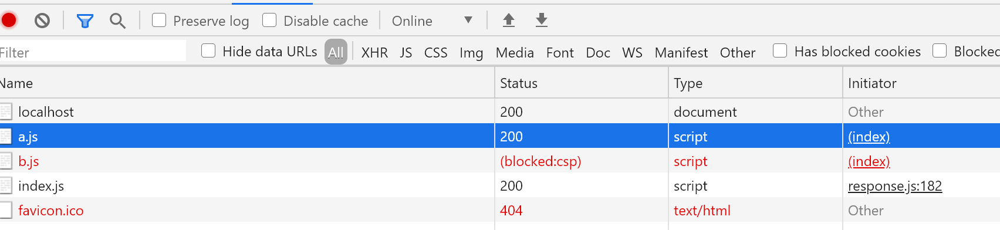

# XSS 攻击及 CSP
---
*2020/11/16*

## 前言

::: tip
  `XSS(跨站脚本攻击)` 和 `CSRF(跨站请求伪造)` 这两个是前端安全绕不开的话题，今天主要学习下 `XSS攻击` 和 `CSP(内容安全策略)`。
:::

## 什么是 XSS

::: tip
  **XSS(跨站脚本攻击)：** 攻击者通过在目标网站上注入恶意脚本，使之在用户浏览器上运行。利用这些恶意脚本，攻击者可获取用户的敏感信息，如（Cookie、SessionID等），进而危害用户数据安全。
:::

## XSS 攻击注入方式、分类

::: tip
  `XSS` 一般有以下几种注入方式：
* 在 `HTML` 内嵌的文本中，恶意内容以 `script` 标签形式注入
* 在内联的 `JavaScript` 中，拼接的数据突破了原本的限制（字符串、变量、方法名等）
* 在标签的 href、src 等属性中，包含 javascript: 等可执行的代码
* 在 onload、onerror、onclick 等事件中，注入不受控制代码

  根据 `XSS` 的注入方式可以将 `XSS攻击` 分为三类：

| 类型 | 存储区 | 插入点 |
| :-- | :-- | :-- |
| 存储型XSS | 后端数据库 | HTML |
| 反射性XSS | URL | HTML |
| DOM型XSS | 后端数据库/前端存储/URL | 前端JavaScript |
:::

## XSS 攻击常规预防措施

::: tip
  从 `XSS攻击` 过程我们可以发现，它要成功的话需要同时满足两个要素：

* 攻击者提交恶意代码
* 浏览器执行恶意代码

  那我们阻断其中之一就可预防 `XSS攻击`，所以对应措施有：

* 输入过滤
* 改成纯前端渲染，把代码和数据分隔开
* 对 `HTML` 做充分转义（特别是直接对DOM元素操作时）
* 设置 `Cookie` 为 HTTP-only
* 验证码校验

  上面这些都是常规的预防 `XSS攻击` 的措施，除此之外，`HTML5` 中新增了 `CSP` 策略，从浏览器层面来处理 `XSS 攻击`，可以说是从根源上预防 `XSS攻击`(各大浏览器都已支持)。
:::

## CSP 是什么

::: warning
  **CSP:** 全称（Content-Security-Policy），是一个额外的安全层，用于检测并削弱某些特定类型的攻击，包括跨站脚本（XSS）和数据注入攻击等。

  `CSP` 的主要目标是减少和报告 `XSS攻击`，`XSS攻击` 利用了浏览器对于从服务器所获取的内容的信任。恶意脚本在受害者的浏览器中得以运行，因为浏览器信任其内容来源，即使有的时候这些脚本并非来自它本该来的地方。

  `CSP` 通过指定有效域 ---- 即浏览器认可的可执行脚本的有效来源 ---- 使服务器管理者有能力减少或消除 `XSS攻击` 所依赖的载体。一个 `CSP` 兼容的浏览器仅执行从白名单获取到的脚本文件，忽略所有的其他脚本（包括内联脚本和HTML的事件处理属性）。

  作为一种终极防护形式，始终不允许执行脚本的站点可以选择全面禁止脚本执行。
:::

## CSP 简单使用

::: tip
  配置 `CSP` 只需添加 `Content-Security-Policy` 到 `HTTP` 头部，并添加相应的值。一个例子说明：

  为模仿跨域，本地启动两个 Node 服务，一个端口3000，一个端口3001，3000端口服务返回的 `HTML` 文件中通过 `script` 标签请求一个3001端口服务提供的js脚本，相关代码如下：

```js
// server:3000 ->  index.js
const express = require('express')
const app = express()

app.use(express.static('./public'))

app.listen(3000, () => {
  console.log(`服务启动成功： http://localhost:3000`)
})

// server:3000 -> public/index.html
<!DOCTYPE html>
<html lang="en">
<head>
  <meta charset="UTF-8">
  <meta name="viewport" content="width=device-width, initial-scale=1.0">
  <title>Document</title>
</head>
<body>
  <div>hello  world</div>
  <script src="a.js"></script>
  <script src="http://localhost:3001/b.js"></script>
</body>
</html>

//server:3000  -> public/a.js
console.log('我是 3000 端口的  a.js')
```

```js
// server:3001 -> index.js
const express = require('express')
const app = express()

app.use(express.static('./public'))


app.listen(3001, () => {
  console.log(`服务启动成功： http://localhost:3001`)
})

// server:3001 -> public/b.js
console.log('我是 3001 端口的  b.js')
```

  启动两个服务，在浏览器向 3000端口发起请求，一切正常，如下：

  

  这里 b.js 文件是外域的，可能不安全，3000服务器不想在客户的浏览器上执行它，简单，只需给 `HTTP` 头配置 `Content-Security-Policy` 属性即可，如下：

```js
// server:3000  index.js
const express = require('express')
const app = express()

app.use((req, res, next) => {
  res.setHeader('Content-Security-Policy', `script-src 'self'`)
  next()
})
app.use(express.static('./public'))

app.listen(3000, () => {
  console.log(`服务启动成功： http://localhost:3000`)
})
```

  再启动两个服务，发起请求，结果如下：

  
  

  可以看到，b.js 文件资源的HTTP请求都没发起就直接被浏览器拦截掉了。
:::

## CSP 属性值说明

::: tip
  一个 `Content-Security-Policy` 头可以配置多个资源，中间用 **;** 分割，且策略中应该包含一个 `default-src` 策略指令，在其他资源类型没有符合自己的策略时用该策略
```js
Content-Security-Policy: default-src 'self'; <policy-directive>; <policy-directive>
```
  除了上面的 `script-src`，它还支持以下地址：
* connect-src ---- 限制能通过脚本接口加载的URL
* default-src ---- 为其他取指令提供备用服务
* font-src ---- 设置允许通过 `@font-face` 加载的字体源地址
* frame-src ---- 设置允许通过类似 \<frame\> 和 \<iframe\> 标签加载的内嵌内容的源地址
* img-src ---- 限制图片和图标的源地址
* style-src ---- 限制层叠样式表文件源
* [其他](https://developer.mozilla.org/zh-CN/docs/Web/HTTP/Headers/Content-Security-Policy)

  \<source\>可以是以下值之一：
* 'self' ---- 指向与要保护的文件所在的源
* 'unsafe-inline' ---- 允许使用内联资源，例如内联 \<script\> 元素(javascript:URL)
* 'unsafe-eval' ---- 允许使用 `eval()` 以及相似的函数来从字符串创建代码
* 'none' ---- 不允许任何内容
* 'nonce-\<base64值\>' ---- 特定使用一次性加密内联脚本的白名单。
* \<hash-source\> ---- 使用 sha256、sha384 或 sha512 编码过的内联脚本或样式

  [回首页](/frontend)
:::

（完）