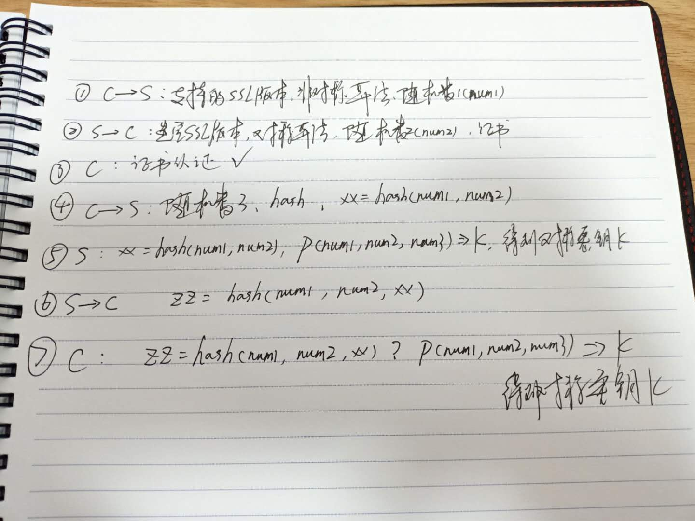

# HTTPS 原理
---
*2020/10/27*

## 为什么要用 HTTPS

::: tip
  HTTP/2.0 以前传输内容都是明文传输，如果黑客想获取，太简单了，所以明文传输安全性不高。
:::

### 使用对称加密
::: tip
  那么使用对称加密可以吗，先解释下对称加密：假设有一个密钥 k 和 传输数据 data，经过某种加密算法 f1，得到密文 x，我们在 HTTP 协议上传输的是经过加密的密文 x( x = f1(k, data))，然后 f1 有一个解密算法 f2，使用和加密算法相同的密钥 k 就能从密文 x 中获取到原始值 data(data = f2(k, x))。因此在传输过程中传输的都是密文 x，且接收方解密后能拿到原始数据 data，这样即使黑客拦截了，获取到的也是密文，没办法解密。那这样是否就安全了呢？

  不是的，因为服务端不知道有多少个客户端会发起连接，也不可能为每一个客户端分配一个 k，所以整个过程只有一个 k，如果黑客冒充一个普通客户，那么他也能拿到这个 k，拿到 k，密文也就不存在了，所以只有一个 k 不行。
:::

### 使用非对称加密
::: tip
  使用非对称加密呢，那么它密钥就有2个，一个公钥 pk，一个私钥 sk，传输方通过公钥 pk 对 data 加密得到密文 y(y = f(pk, data))，接收方通过私钥 sk 对密文 y 解密得到数据原始值 data(data = f(sk, y))。同样，用私钥对数据加密，可以使用公钥对数据解密。

  非对称加密通信过程如下，服务端存有公钥 pk 和私钥 sk，首先客户端发起请求获取公钥 pk，然后客户端再使用公钥 pk 对数据加密后发起请求，服务端通过私钥 sk，对数据解密，拿到客户端传输的原始值。这样即使黑客截取了密文，但是私钥只存在于服务器，黑客也无法对密文 y 进行解密，所以万事大吉了？

  这也有个很大的问题，服务端怎么向客户端发数据呢，首先肯定不能使用公钥对数据加密，因为客户端没有私钥，也就没办法解密。那如果服务端使用私钥向数据加密呢？这样虽然客户端能拿到数据并使用公钥进行解密，但是黑客也能拿到公钥，所以黑客也能对服务端发送的密文进行解密。

  结论：使用对称加密和非对称加密都不行。
:::

### 使用对称加密 + 非对称加密
::: tip
  世界上总有一群聪明的人存在，他们从对称加密和非对称加密各自的缺陷中找到灵感。

  对称加密的缺点是因为只有一个"透明"的密钥 k，那如果有一个只有客户端和服务端知道的 k 呢，确实可以实现安全传输。

  非对称加密，在客户端向服务端发数据时是安全的，服务端向客户端发数据就不安全了，那如果把对称加密和非对称加密结合起来呢。先利用非对称加密的方式，在客户端和服务端达成一个协商，协商出一个临时制定的 k，然后在使用协商出的这个 k 进行数据的交互，因为这个 k 是客户端和服务端临时协商的，也就是独一无二的。

  具体流程是这样，首先客户端还是向服务端发请求索要公钥 pk，服务端返回 pk，接下来客户端对一个随机数据 num1 用公钥 pk 加密，传输给服务端，服务端用私钥对数据解密，得到 num1，服务端解密得到 num1 后返回 ok，通知客户端获取成功，num1 就作为以后对称加密的协商临时密钥 k。这样黑客就没办法了吗？

  假设黑客自己也有一套公钥私钥，并且在客户端第一次向服务端请求公钥就被拦截了，客户端获取到的其实是黑客的假公钥，黑客假装自己很无辜，他也向真正的服务端发起请求获取公钥，然后服务端把真正的公钥返回给黑客。接下来到第二步，客户端用黑客的假公钥加密一个随机数 num1，这个也被黑客拦截，他能通过自己的私钥解密，获取到 num1，然后向客户端返回 ok，告诉客户端以后可以通过 num1 作为密钥进行对称加密通信。同时黑客使用真正服务端返回的公钥对 num1 加密后发送给真正的服务端，服务端解密得到 num1，向黑客返回 ok。之后每次客户端向服务器发起的请求都被黑客拦截，并且黑客也使用相同的密钥 num1 向服务端发相同的请求，这样黑客能获取到客户端的所有信息。所以这里还有一点点问题，**中间人问题** 。
:::

### 小结
::: tip
* 明文传输： 等于裸奔
* 对称加密： 密钥 k 唯一，也等于裸奔
* 非对称加密： 客户端向服务端发数据安全，服务端向客户端发数据不安全
* 对称加密 + 非对称加密：中间人问题
:::

### 中间人问题解决方案
::: tip
  中间人是在第一次通信时就介入的，解决的方式也比较简单，引入 **CA认证**，因为中间人问题是客户端无法识别拿到的公钥是否是安全的，那么可以引入一个第三方的权威机构，只有他认证过的公钥，客户端才接受，不然都认为是黑客。

  整个过程是这样的，服务端有公钥 pk 和私钥 sk，CA 也有自己的公钥 cpk 和私钥 csk，然而服务端的 pk 并不是客户端向服务端索要时就立马返回给客户端，而是使用 CA 的私钥 csk 对服务端的公钥 pk 加密，得到一份证书 license(license = f(csk, pk))，即客户端第一次请求并不是请求服务端公钥 pk 了，而是请求服务端的证书 license，客户端拿到 license 之后怎么拿到服务端公钥 pk 呢，因为这个 license 是服务端公钥 pk 用 CA 私钥 csk 加密生成的，所以客户端只需要用 CA 的公钥 cpk 对 license 解密即可拿到服务端公钥 pk。那么客户端向 CA 机构获取其公钥 cpk 的时候是不是也会被黑客截获呢，完全有可能，所以客户端干脆不发请求获取 CA 公钥 cpk 了，直接把 cpk 写死在操作系统(或者浏览器)中，其实我们现在电脑中就包含很多 CA 机构的公钥 cpk。这样就能安全的拿到服务端的公钥 pk。之后客户端再通过服务端公钥 pk 和服务端协商临时密钥 k，进行对称加密交互过程。**补充**：获取证书 license(license = f(csk, pk)) 这一步是在 CA 机构完成的，一般CA机构也是要收费的。
:::

## 协商设置对称加密密钥详细过程
::: tip
  HTTPS 中客户端拿到和服务端的 **协商密钥 k** 过程有点复杂(即四次挥手)，下面详细说下：

  1. 客户端第一次发请求获取服务端 license 的时候会携带一些信息，比如支持的 SSL版本，非对称算法，以及随机数1 num1
  2. 服务端接收到数据后返回一个 SSL 版本，一个对称算法，随机数2 num2 和 证书 license
  3. 客户端在本地做证书认证，如果认证成功继续往下
  4. 客户端再向服务端发一起请求，发送一个随机数3 num3 和一个散列算法(如 hash())，并将前面的两个随机数 num1、num2用这个算法做散列运算，得到一个新数 xx 一起发送给服务器
  5. 服务端接收到数据，先验证 xx 是不是由 num1、num2 经过 hash(num1, num2) 算法得到的，如果是，说明客户端身份没问题，然后服务端再通过一个特殊的算法p(前后端一致)对 num1、num2、num3 进行运算得到对称加密密钥 k，服务端并不会将这个密钥 k 返回给客户端，自己保持起来
  6. 服务端将 num1、num2、xx 再执行一次 hash 算法得到 zz，将 zz 返回给客户端
  7. 客户端只需对 num1、num2、xx 做一次 hash 运算，和服务端返回的 zz 做对比，如果比对成功，则说明服务端身份正确，也用和后端相同的特殊算法p对 num1、num2、num3 运算得到对称密钥 k。因为 k 都是服务端和客户端各自生成的，不存在信道传输，也就不存在被黑客拦截

  
:::

## 总结 
::: tip
  HTTPS = 对称加密 + 非对称加密 + hash算法 + CA

  [回首页](/frontend)
:::

（完）