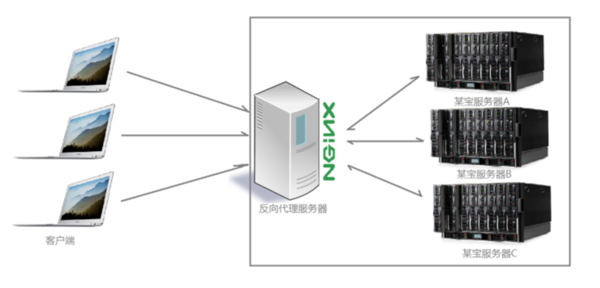

# 浏览器原生网络请求方法及跨域处理
---
*2020/11/02*

## 前言

::: tip
  以前自己项目中用得最多的网络请求包是 **axios**，它并不是浏览器原生支持的对象，它内部的实现原理是 **XMLHttpRequest** 对象，今天就看看浏览器原生支持的这些网络请求对象，到时候按需取用。
:::

## XMLHttpRequest

### XHR 出现 

::: tip
  当年 Ajax 技术让发送服务器请求额外数据而不刷新页面成为可能，而真正将 Ajax 推上历史舞台的关键技术是 **XMLHttpRequest(XHR)**，*虽然名称中包含XML，但实际上Ajax通信与数据格式无关*，XHR 对象最早由微软发明，然后被其他浏览器借鉴，现所有浏览器都原生支持。
:::

### XHR 使用 

::: tip
  使用 XHR 对象首先要调用 open() 方法，这个方法接收三个参数：请求类型（get、post等），请求URL，以及表示请求是否异步的布尔值。

  调用 open() 不会实际发送请求，只是为发送请求做好准备，要发送定义好的请求，必须调用 send() 方法，send() 方法接收一个参数，作为请求体发送的数据。如果不需要发送请求体，则必须传null（某些浏览器）。

``` js
const xhr = new XMLHttpRequest()
xhr.open('get', 'abc', false)
xhr.send(null)
```

  因为这个请求是同步的，所以服务器响应后会在 XHR 对象的以下属性上填充数据。

* responseText: 作为响应体返回的文本。
* responseXML: 如果响应的内容类型是"text/xml"或"application/xml"，那就是包含响应
数据的 XML DOM 文档。
* status: 响应的 HTTP 状态码。
* statusText: 响应的HTTP状态描述。

  收到响应后，通过检查 status 属性以确定响应成功与否。虽然可以同步发送请求，但多数情况下最好使用异步。

:::

::: tip

  XHR 对象有一个 readyState 属性，表示当前处在请求/响应过程的哪个阶段，这个属性可能的值如下：

* 0: 未初始化（Uninitialized）。尚未调用 open()方法。
* 1：已打开（Open）。已调用 open()方法，尚未调用 send()方法。
* 2：已发送（Sent）。已调用 send()方法，尚未收到响应。
* 3：接收中（Receiving）。已经收到部分响应。
* 4：完成（Complete）。已经收到所有响应，可以使用了。

  每次 readyState 从一个值变成另一个值，都会触发 readystatechange 事件，可以借此机会检验 radyState 的值，以判断响应何时返回。

  每个 HTTP 请求可以通过 xhr.setRequestHeader() 方法来设置，传入两个参数，分别是 http 请求头名称和对应的值。可以通过 xhr.getResponseHeader() 方法获取响应头部信息。

:::

::: tip

  XHR 进度事件：

* loadstart：在接收到响应的第一个字节时触发。
* progress：在接收响应期间反复触发。
* error：在请求出错时触发。
* abort：在调用 abort()终止连接时触发。
* load：在成功接收完响应时触发。
* loadend：在通信完成时，且在 error、abort 或 load 之后触发。

  每次请求都会首先触发 loadstart 事件，之后是一个或多个 progress 事件，接着是 error、abort 或 load 中的一个，最后以 loadend 事件结束。
:::

## Fetch

### 简单介绍

::: tip
  随着前端逐步标准化，XMLHttpRequest 也出现了一个替代品，Fetch。Fetch API 能够执行 XMLHttpRequest 对象的所有任务，并且更容易实现，接口也更现代化，能够在 Web 工作线程等现代 Web 工具中使用。XMLHttpRequest 可以选择异步，而 Fetch API 则必须是异步。
:::

### 基本用法

::: tip
  fetch() 方法是暴露在全局作用域中的，包括主页面执行线程、模块和工作线程。调用这个方法，浏览器就会向给定 URL 发送请求。

  fetch() 只有一个必须的参数 input，多数情况下，这个参数是要获取资源的 URL，这个方法返回一个 Promise。

``` js
let r = fetch('/bar')
console.log(r) // Promise <pending>
```

  请求完成、资源可用时，Promise 会返回一个 Response 对象，这个对象是 API 的封装，可以通过它取得相应资源。读取响应内容最简单的方式是取得纯文本格式的内容，这要用到 response.text() 方法，并且这个方法也返回一个 Promise。

  fetch() 方法还接收第二个 init 对象参数，它可以有如下属性：

| 键 | 值 |
| :-- | :-- |
| body | 指定使用请求体时请求体的内容 |
| cache | 用于控制浏览器与 HTTP缓存的交互 |
| credentials | 用于指定在外发请求中如何包含 cookie，与 XHR 的 withCredentials 类似 |
| headers | 用于指定请求头部 |
| integrity | 用于强制子资源完整性| 
| keepalive | 用于指示浏览器允许请求存在时间超出页面生命周期 |
| method | 用于指定 HTTP 请求方法 |
| signal | 用于支持通过 AbortController 中断进行中的 fetch() 请求 | 

:::

### Headers 对象

::: tip
  Headers 对象时所有外发请求和入站响应头部的容器，每个外发的 Request 实例都包含一个空的 Headers 实例，可以通过 Request.prototype.headers 访问，每个入站的 Rersponse 实例也可以通过 Response.prototype.headers 访问包含着响应头部的 Heades 对象。这两个属性都是可修改属性，另外，使用 new Headers() 也可以创建一个新实例。

  Headers 与 Map 极为类似，因为 HTTP 头部本质上是序列化后的键/值对，Headers 与 Map 类型都有 get()、set()、has() 和 delete() 等实例方法。
:::

### Request 对象

::: tip
  Resuest 对象是获取资源请求的接口，这个接口暴露了请求的相关信息。

  可以通过构造函数初始化 Request 对象，为此需要传入一个 input 参数，一般是 URL:

``` js
let r = new Request('https://lbjning.com')
console.log(r)
// Request {...}
```

  Request 构造函数也可以接收第二个参数 ---- 一个 init 对象，和前面介绍的 fetch() 的 init 对象一样。

  可将 Request 实例对象作为参数调用 fetch() 方法来发起一个 HTTP 请求。
:::

### Response 对象

::: tip
  Response 对象是获取资源响应的接口，这个接口暴露了响应的相关信息。Response 对象包含如下一组只读属性：

  | 属性 | 值 |
  | :-- | :-- |
  | headers | 响应包含的 Headers 对象 |
  | ok | 布尔值，表示 HTTP 状态码的含义，200~299的状态码返回true，其他状态码返回false |
  | redirected | 布尔值，表示响应是否至少经过一次重定向 |
  | status | 整数，表示响应的 HTTP 状态码 |
  | statusText | 字符串，包含对 HTTP 状态码的正式描述 |
  | url | 包含响应 URL 的字符串，对于重定向，这是最终的 URL |
:::

## Beacon

::: tip
  为了把尽量多的页面信息传到服务器，很多分析工具需要在页面声明周期中尽量晚的时候向服务器发送遥测或分析数据。因此，理想的情况下是通过浏览器的 unload 事件发送网络请求。这个事件表示用户要离开当前页面，不会再生成别的有用信息了。

  在 unload 事件触发时，分析工具要停止收集信息并把收集到的数据发给服务器。这时候有一个问题，因为 unload 事件对浏览器意味着没有理由再发送任何结果未知的网络请求（因为页面都要被销毁了）。例如，在 unload 事件处理程序中创建的任何异步请求都会被浏览器取消。为此，异步 XMLHttpRequest或 fetch()不适合这个任务。分析工具可以使用同步 XMLHttpRequest 强制发送请求，但这样做会导致用户体验问题。浏览器会因为要等待 unload 事件处理程序完成而延迟导航到下一个页面。

  为了解决这个问题，W3C 引入了补充性的 **Beacon API**。这个 API 给 navigator 对象增加了一个 sendBeacon() 方法。这个简单的方法接受一个 URL 和一个数据有效载荷参数，并会发送一个 POST 请求。如果请求成功进入了最终要发送的任务队列，则这个方法返回 true，否则返回 false。

``` js
// 发送 POST 请求
// URL: 'https://example.com/analytics-reporting-url' 
// 请求负载：'{foo: "bar"}' 
navigator.sendBeacon('https://example.com/analytics-reporting-url', '{foo: "bar"}')
```

  这个方法虽然看起来只不过是 POST 请求的一个语法糖，但是它有几个重要的特性：

* sendBeacon()并不是只能在页面生命周期末尾使用，而是任何时候都可以使用。
* 调用 sendBeacon()后，浏览器会把请求添加到一个内部的请求队列。浏览器会主动地发送队列中的请求。
* 浏览器保证在原始页面已经关闭的情况下也会发送请求。
* 状态码、超时和其他网络原因造成的失败完全是不透明的，不能通过编程方式处理。
* 信标（beacon）请求会携带调用 sendBeacon()时所有相关的 cookie。
:::

## Web Socket

::: tip
  Web Socket 的目标是通过一个长时连接与服务器全双工、双向通信。在 JavaScript中创建 Web Socket 时，一个 HTTP 请求会发送到服务器以初始化连接。服务器响应后，连接使用 HTTP的 Upgrade 头部从 HTTP 协议切换到 Web Socket 协议。这意味着 Web Socket 不能通过标准 HTTP 服务器实现，而必须使用支持该协议的专有服务器。

  因为 Web Socket使用了自定义协议，所以 URL方案（scheme）稍有变化：不能再使用 http://或 https://，而要使用 ws://和 wss://。前者是不安全的连接，后者是安全连接。在指定 Web Socket URL 时，必须包含 URL 方案，因为将来有可能再支持其他方案。

  使用自定义协议而非 HTTP 协议的好处是，客户端与服务器之间可以发送非常少的数据，不会对HTTP 造成任何负担。使用更小的数据包让 Web Socket 非常适合带宽和延迟问题比较明显的移动应用。使用自定义协议的缺点是，定义协议的时间比定义 JavaScript API 要长。Web Socket 得到了所有主流浏览器支持。
:::

## 跨域处理

### CORS

::: tip
  默认情况下，XHR 只能访问与发起请求页面在同一个域内的资源，CORS 定义了浏览器与服务器如何实现跨源通信，CORS 背后的基本思路就是使用自定义的 HTTP 头部允许浏览器和服务器相互了解，以确定请求或响应应该成功还是失败。

:::

#### 简单请求

::: tip

  对于简单的请求，比如 GET 或 POST 请求，没有自定义头部，而且请求体是 text/plain 类型，这样的请求在发送时会有一个额外的头部叫 **Origin** 。Origin 头部包含发送请求的页面源（协议、域名和端口），以便服务器是否为其提供响应，如：

``` js
Origin: http://www.lbjning.com
```

  如果服务器决定响应请求，那么应该发送 **Access-Control-Allow-Origin** 头部，包含相同的源，或者如果资源是公开的，那么就包含 "*"，如：

``` js
Access-Control-Allow-Origin: http://www.lbjning.com
```

  如果没有这个头部，或者有但源不匹配，则表明不会响应浏览器请求。否则服务器就会处理这个请求。**注意**：无论请求还是响应都不会包含 cookie 信息。现代浏览器通过 XMLHttpRequest 对象原生支持 CORS。在访问不同源的资源时，这个行为会被自动触发。
:::

#### 预检请求

::: tip
  CORS 通过**预检请求** 的服务器验证机制，允许使用自定义头部、除 GET 和 POST 之外的方法，以及不同请求体内容类型。在要发送涉及上述某种高级选项的请求时，会先向服务器发送一个 "预检" 请求。这个请求使用 OPTIONS 方法发送并包含以下头部。

* Origin: 与简单请求相同。
* Access-Control-Request-Method: 请求希望使用的方法。
* Access-Control-Request-Headers: （可选）要使用的逗号分隔的自定义头部列表。

  在这个请求发送后，服务器可以确定是否允许这种类型的请求。服务器会通过在响应中发送如下头部与浏览器沟通这些信息：

* Access-Control-Allow-Origin: 与简单请求相同。
* Access-Control-Allow-Methods: 允许的方法（逗号分隔的列表）。
* Access-Control-Allow-Headers：服务器允许的头部（逗号分隔的列表）。
* Access-Control-Max-Age：缓存预检请求的秒数。

  预检请求返回后，结果会按响应指定的时间缓存一段时间。也就是说，只有第一次发送这种类型的请求时才会多发送一次额外的 HTTP 请求。

  默认情况下，跨源请求不提供凭据（cookie、HTTP 认证和客户端 SSL 证书）。可以通过将 withCredentials 属性设置为 true 来表明请求会发送凭据。
:::

### 图片探测

::: tip
  图片探测是利用 img 标签实现跨域通信的最早的一种技术。任何页面都可以跨域加载图片而不必担心限制，因此这也是在线广告跟踪的主要方式。可以动态创建图片，然后通过它们的 onload 和 onerror 事件处理程序得知何时收到响应。

  图片探测是与服务器之间简单、跨域、单向的通信，数据通过查询字符串发送，响应可以随意设置，浏览器通过图片探测拿不到任何数据。如:

``` js
  let img = new Image()
  img.onload = img.onerror = () => {
    console.log('done')
  }

  img.src = 'http://www.example.com/test?name=zhangsan'
```
:::

### JSONP

::: tip
  关于 JSONP，详见之前的一篇文章 [JSONP 方法原理及实现](/frontend/jsonp)
:::

### Nginx

::: tip
  nginx 是反向代理服务器的一种，关于它的原理，一张图说明：

  

  [回首页](/frontend)
:::

（完）