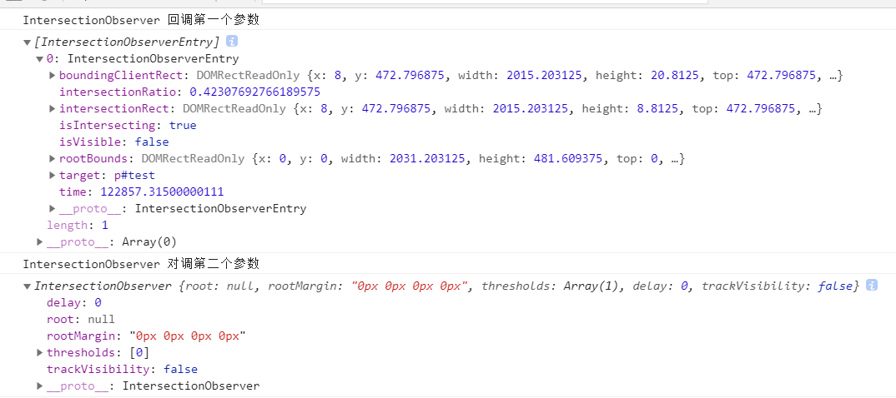
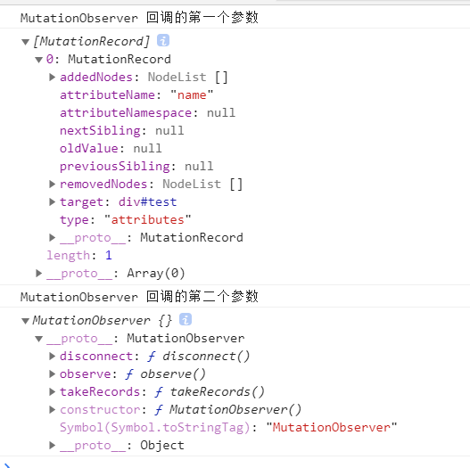
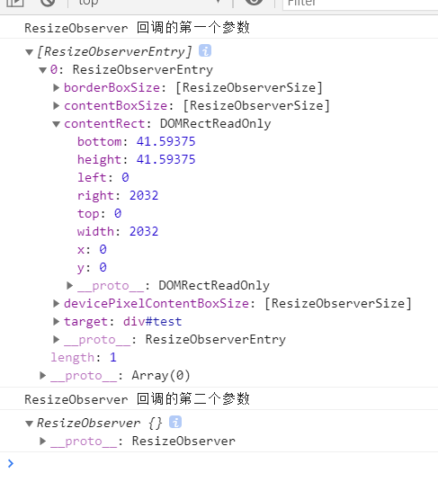
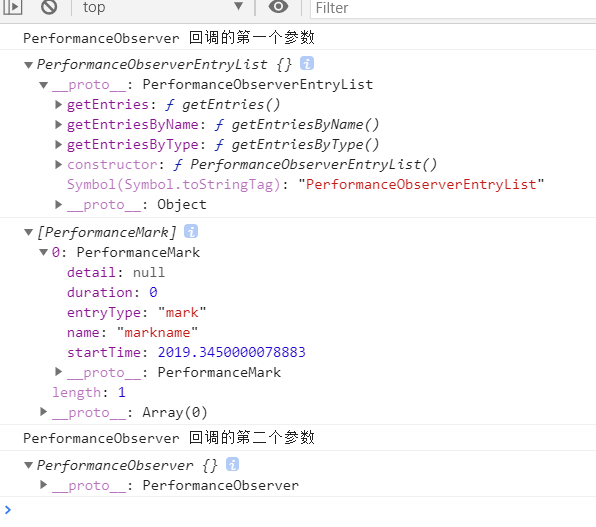

# 现代浏览器提供的四个 Web Observer 对象
---
*2020/11/13*

## 前言

::: tip
  工作中大部分用 Vue，很少直接操作 DOM 元素了，今天看看浏览器给我们提供的四个 Observer 对象，可以配合 Vue 的指令或其他方式，让它在程序中发挥它该有的作用。
:::

::: warning
* [IntersectionObserver](https://developer.mozilla.org/zh-CN/docs/Web/API/IntersectionObserver) ---- 提供了一种异步观察目标元素与其祖先元素或顶级文档视窗(viewport)交叉状态的方法。祖先元素与视窗(viewport)被称为**根(root)**
* [MutationObserver](https://developer.mozilla.org/zh-CN/docs/Web/API/MutationObserver) ---- 提供了监视对 `DOM` 树所做更改的能力。它被设计为旧的 `MutationEvents` 功能的替代品，该功能是 `DOM3 Events` 规范的一部分
* [ResizeObserver](https://developer.mozilla.org/zh-CN/docs/Web/API/ResizeObserver) ---- 可以监听到 `Element` 的内容区域或 `SVGElement` 的边界框改变。`ResizeObserver` 避免了在自身回调中调整大小，从而触发的无限回调和循环依赖。
* [PerformanceObserver](https://developer.mozilla.org/zh-CN/docs/Web/API/PerformanceObserver/PerformanceObserver) ---- 构造函数使用给定的观察者 `callback` 生成一个新的 `PerformanceObserver` 对象。当通过 `observe()` 方法注册的`条目类型`的`性能条目事件`被记录下来时，调用该观察者回调。

  下面详细看看每个对象
:::

## IntersectionObserver 

::: tip
  通俗一点说，通过这个对象，可以对一个 `DOM` 元素的可见性进行监视，当它的可见性发生改变时，执行指定的回调函数。它的构造函数如下：
:::

### API 介绍

#### 构造函数

::: tip
  构造函数接收两个参数 `callback`、`options(可选)`
```js
const observer = new IntersectionObserver(callback[, options])
```

* callback ---- 当元素可见性改变后执行的回调函数，此回调函数接受两个参数:
  * entries ---- 一个 `IntersectionObserverEntry` 对象的数组，该对象包含一些当前元素与交叉区域信息相关的只读属性
  * observer ---- 调用该方法的 `IntersectionObserver` 实例
* options ---- 一个可以用来配置 observer 实例的对象
 
:::

#### 实例方法

::: tip
  `IntersectionObserver` 实例对象还包含4个方法：
* observer.disconnect() ---- 对象停止监听工作
* observer.observe() ---- 开始监听一个目标元素
* observer.takeRecords() ---- 返回所有观察目标的 `IntersectionObserverEntry` 对象数组
* observer.unobserve() ---- 停止监听特定目标元素
:::

### API 简单使用

::: tip
```js
const ele = document.getElementById('test')
const callback = (entries, ob) => {
  console.log('IntersectionObserver 回调第一个参数')
  console.log(entries)
  console.log('IntersectionObserver 对调第二个参数')
  console.log(ob)
}
const observer = new IntersectionObserver(callback)
observer.observe(ele)
```

  当 `ele` 元素可见性改变时会执行回调，打印信息如下：

  

:::

### API 使用场景

::: tip
  依赖元素可见性来实现的功能可考虑使用 `IntersectionObserver` 对象，如 `图片延迟加载`、`无限滚动`
:::

## MutationObserver

::: tip
  只要观察的 `DOM` 树发生改变就执行回调。
:::

### API 介绍

#### 构造函数

::: tip
  构造函数只有一个参数 `callback`

```js
const observer = new MutationObserver(callback)
```

* callback ---- 每当被指定的结点或子树以及配置项有 DOM 变动时会被调用。回到函数拥有两个参数：
  * MutationRecord 对象 ---- DOM 变动详细描述
  * 调用该方法的 `MutationObserver` 实例
:::

#### 实例方法

::: tip
  `MutationObserver` 实例对象包含3个方法：
* observer.discount() ---- 阻止 `MutationObserver` 实例继续接收通知，直到再次调用 `observe()` 方法
* observer.observe() ---- 配置 `MutationObserver` 在 DOM 更改匹配给定选项时，通过其回调函数开始接收通知，有两个参数
  * target ---- DOM 树中的一个要观察变化的 DOM Node/Element，或者是被观察的子节点树的根节点。
  * options(可选)
* observer.takeReocrds() ---- 从 `MutationObserver` 的通知队列中删除所有待处理的通知，并将它们返回到 `MutationRecord` 对象的新 Array 中
:::

### API 简单使用

::: tip
```js
const ele = document.querySelector('#test')
const callback = (record, ob) => {
  console.log('MutationObserver 回调的第一个参数')
  console.log(record)
  console.log('MutationObserver 回调的第二个参数')
  console.log(ob)
}
const observer = new MutationObserver(callback)
observer.observe(ele, { attributes : true })
ele.setAttribute('name', 'my-class')
```
  打印信息如下：

  
:::

### API 使用场景

::: tip
  监视某个 DOM 元素属性、子元素的修改，可用于监控系统中 `Web 页面录制(rrweb)` 等。
:::

## ResizeObserver 

::: tip
  `ResizeObserver` 监听到 `Element` 的内容区域或 `SVGElement` 的边界框改变，并且避免了在自身回调用调整大小而触发的无限回调和循环依赖。它仅通过在后续帧中处理 DOM 中更深层次的元素来实现这一点。
:::

### API 介绍

#### 构造函数

::: tip
  构造函数接收一个参数 `callback`。

```js
const observer = new ResizeObserver(callback)
```

* callback ---- 当尺寸发生变化时触发回调，回调函数拥有两个参数：
  * `ResizeObserverEntry` 数组
  * 调用该方法的 `ResizeObserver` 实例
:::

#### 实例方法

::: tip
 `ResizeObserver` 包含3个实例方法。
* observer.disconnect() ---- 取消和结束目标对象上所有对 `Element` 或 `SVGElement` 观察
* observer.observe() ---- 开始观察指定的 `Element` 或 `SVGElement`
* observer.unobserve() ---- 结束观察指定的 `Element` 或 `SVGElement`
:::

### API 简单使用

::: tip
```js
const ele = document.querySelector('#test')
const callback = (enries, ob) => {
  console.log('ResizeObserver 回调的第一个参数')
  console.log(enries)
  console.log('ResizeObserver 回调的第二个参数')
  console.log(ob)
}
const observer = new ResizeObserver(callback)
observer.observe(ele)
```
  拖动浏览器窗口大小触发回调，控制台打印如下信息：

  
:::

### API 使用场景

::: tip
  监视尺寸改变执行回调，可以更好的实现程序响应式，取代 `@media`。
:::

## PerformanceObserver 

::: tip
  `PerformanceObserver` 用于监测性能度量事件，在浏览器的性能时间轴记录下一个新的 `performance entries`  的时候将会被通知 。
:::

### API 介绍

#### 构造函数

::: tip
  构造函数接收一个参数 `callback`

```js
const observer = new PerformanceObserver(callback)
```

* callback ---- 观察的性能事件被记录将执行回调，回调接收两个参数：
  * PerformanceObserverEntryList ---- 性能观察条目列表
  * 调用该方法的 `PerformanceObserver` 实例
:::

#### 实例方法

::: tip
  `PerformanceObserver` 有2个实例方法：
* observer.disconnect() ---- 性能监测回调停止接收 `性能条目`
* observer.observe() ---- 指定监测的 `entryTypes` 的集合。当 `performance entry` 被记录并且是指定的 `entryTypes` 之一的时候，性能观察者对象的回调函数会被调用，其参数为 options，

```js
options: {
  entryTypes: ['measure', 'resource']
}
```

| Value | Description of name property |
| :---  | :--- |
| resource | 分析有关加载应用程序资源的详细网络计时数据 |
| mark | 调用 `performance.mark('name')` 时获取标记的相关时间点信息 |
| measure | 测量两个 `mark` 之间的执行时间点信息 |
| paint | 提供页面在构建过程中 `绘制(渲染)` 的时间点信息 |
:::

### API 简单使用

::: tip
```js
const options = {
  entryTypes: [ 'mark']
}
const callback = (list, ob) => {
  console.log('PerformanceObserver 回调的第一个参数')
  console.log(list)
  console.log(list.getEntries())
  console.log('PerformanceObserver 回调的第二个参数')
  console.log(ob)
}
const observer = new PerformanceObserver(callback)
observer.observe(options)
setTimeout(() => {
  performance.mark('markname')
}, 2000);
```

  2s后，浏览器控制台打印如下：

  
:::

### API 使用场景

::: tip
  `PerformanceObserver` 主要用于监测指定条目的性能，此特性可以在 `Web Worker` 中使用。

  [回首页](/frontend)
:::

（完）