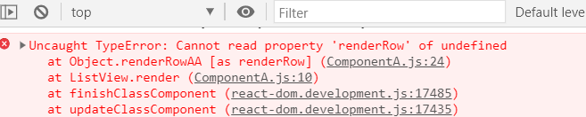
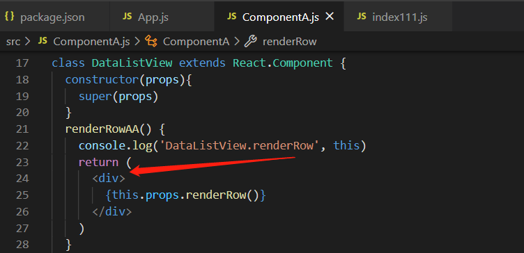
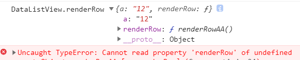

# React class 组件中方法传递的坑
---
*2020/12/04*

## 前言

::: tip
  先看一个错误，如下图

  

  

  第一反应，不可能啊，组件的 `props` 属性怎么可能是 `undefined`，别着急，我们慢慢看。
:::

## 项目代码

::: tip
  这里会有 3 个 组件，分别为 `ComponentA`、`DataListView` 、 `ListView`，其中，`ComponentA` 组件是 `DataListView` 组件的父组件， `DataListView` 组件是 `ListView` 组件的父组件，它们的简单实现如下：

```js
// ComponentA.js
class ComponentA extends React.Component {
  renderRow = () => {
    return (
      <div>
        <h4>ComponentA.renderRow</h4>
        <button onClick={() => console.log('click')}>click me</button>
      </div>
    )
  }
  render() {
    return (
      <div>
        <h2>ComponentA 自己</h2>
        <DataListView renderRow={this.renderRow}></DataListView>
      </div>
    )
  }
}
```

```js
// DataListView
class DataListView extends React.Component {
  constructor(props){
    super(props)
  }
  renderRow() {
    console.log('DataListView.renderRow', this)
    return (
      <div>
        {this.props.renderRow()}
      </div>
    )
  }
  render() {
    return (
      <div>
        <h2>DataListView 自己</h2>
        <ListView a='12' renderRow={this.renderRow}></ListView>
      </div>
    )
  }
}
```

```js
// ListView
class ListView extends React.Component {
  constructor(props){
    super(props)
  }
  render() {
    return (
      <div>
        {this.props.renderRow()}
      </div>
    )
  }
}
```

  所有代码就这么多，组件都很简单，主要是有一个 `renderRow()` 方法在多个组件之间传递，下面我们分析下代码的执行过程。
:::

## 通过代码执行过程找出问题原因

::: tip
  要搞清楚代码执行过程，主要是因为 `DataListView.renderRow()` 方法里面有个 `this`，它是运行时才能确定其指向的。

  从 `ComponentA.render()` 方法开始，这个方法里面又实例化了一个 `DataListView` 组件，给 `DataListView` 实例赋值的时候有个 `this` ， 这个是render函数内部的 `this`， 指向 `ComponentA` 实例本身，所以 `ComponentA.renderRow` 能顺利的传递给 `DataListView` 组件，并且保存在 `DataListView` 组件实例的 `props` 属性中。

  实例化 `DataListView` 组件后，执行它的 `render()` 方法，这个 `render()` 方法内部的 `this` 指向 `DataListView` 实例本身，所以它也能将 `DataListView` 实例的 `renderRow()` 方法传递给 `ListView` 组件实例，并且挂载在 `ListView` 组件实例的 `props` 属性上。

  实例化 `ListView` 组件后也会执行它的 `render()` 方法，其内部执行 `this.props.renderRow()` 方法，这个方法指向 `DataListView.renderRow()`，但是这个方法内部的 `this` 指向已经发生了改变，不是指向 `DataListView` 组件实例，而是指向调用它的 **[ListView].props** ，`DataListView.renderRow()` 方法内部就变成 `[ListView].props.props.renderRow()`，很明显，第二个 `props` 是 `undefined`。

  为了验证，我在 `DataListView.renderRow()` 方法中把 `this` 给打印出来看看，并且给 `ListView` 组件 `a` 属性赋值 12，以做标记，`a` 属性也会保存在 `[ListView].props` 中，如下：

```js
// DataListView
// ...
renderRow() {
  console.log('DataListView.renderRow', this)
  return (
    <div>
      {this.props.renderRow()}
    </div>
  )
}
// ...
```

  
:::

## 解决问题

::: tip
  问题的原因又是这个该死的 `this`，它的运行时绑定，出了问题让很多人都摸不着头脑。解决它的方法也很简单，将所有要传递的 `renderRow()` 方法定义改为 **箭头函数** 定义，即

```js
renderRow = () => {
    return (
      <div>
        {this.props.renderRow()}
      </div>
    )
  }
```

  或者，是时候拥抱 **React/Vue Hooks** 了。
:::

## 箭头函数的 this 指向

::: tip
  为什么将方法改成箭头函数就可以了，这里再补充下箭头函数的 `this` 指向问题。

  因为原来定义方法中的 `this` 是由程序运行时决定的，所以它的灵活性太大，变得不可控，所以新规范中规定 `箭头函数` 的 `this` 指向是在定义这个方法的时候确定的，可以理解为编译时期就已经确定了，那么它指向哪里呢？它指向它函数体内部的**作用域链的上一个结点**。

  [回首页](/frontend)
:::

（完）