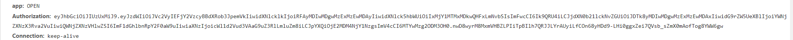
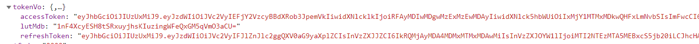

# Web 用户认证
---
*2020/10/28*

## 前言

::: tip
  很多网站都会有登录系统，包括我们银行的开放平台，既然有登录就会涉及到用户认证这个环节，用户认证环节就涉及到 Cookie、Session、Token 这些知识点，今天结合我们银行的一些实践把这些说清楚。
:::

## 基本概念

::: tip
  首先，这三个东西不是一个维度的，他们的功能根本不一样，所以不能放在一起对比，下面逐一说明。
:::

### Cookie

::: tip
  Cookie 是一个容器(内存不超过4kb)，在浏览器上保存着服务端返回回来的一些信息，并且浏览器每次向服务端发送请求时都会自动带上 Cookie 中的内容，所以 Session 信息和 Token 信息都可以放在 Cookie 中，免去客户端在每次请求时都附加一次认证信息的麻烦，但这也有弊端，Cookie 空间有限，优先都是考虑不使用 Cookie，还有就是 Cookie 不支持跨域。Cookie 里面还有其他属性可以设置如 maxAge、httpOnly等，可以参考 [HTTP 网络协议](./http)。

  我们先记住 Cookie 只是一个容器，里面放什么信息是由我们决定的。
:::

### Session

::: tip
  这里的 Session 和 HTML5 中的  sessionStorage 不是一个东西，这里的 Session 可以理解为 SessionId，客户端登录成功，服务端生成一个 SessionId，保存并返回给客户端，以后客户端每次请求带上这个 SessionId 就表示当前用户已登录，有权限做其他操作。这样也弊端，首先是等于在服务端维护着每个客户的状态，如果客户数量很多，那对服务端是一个考验，再就是服务端的 SessionId 保存在哪台服务器上呢？你这台服务器上有那个客户的 SessionId，那如果这个客户的请求被转发到了其他服务器怎么办，可能会说把 SessionId 都保存在统一入口那里，那对入口服务器也会是一个很大考验。*Session 不仅仅是SessionId，它包含状态相关的多个信息，通过SessionId来标识，保存在服务端，与此相对应的，Cookie是会话信息保存在客户端*
:::

### Token

::: tip
  那就有人想了，既然维护状态这么麻烦，那不维护状态不就行了吗，所以就有了 Token，那 Token 是怎么做到在服务端不保存用户状态的情况下判断该用户是否能通过认证呢。

  一个标准的 Token 信息如下：
:::

  

::: tip
  仔细看可以发现它是由 **.** 号分割的三部分组成，这三部分分别是 Header、荷载 payload、签名。可以理解为前两者是一个对象，而最后签名是由这两个对象生成的。再具体点：
:::

#### header

::: tip
  它主要是描述 JWT(JSON Web Tokens) 的元数据，是一个JSON对象，通常是下面的样子：
``` js
{
  "alg": "HS256", //  生成签名的算法，默认是 HS256
  "typ": "JWT" // 代表这个 Token 的类型，JWT Token 统一写为 JWT
}
```
  然后将上面的对象使用 Base64URL 算法，得到 Token 的第一部分。
:::

#### payload 

::: tip
  payload 也是一个 JSON 对象，用来存放实际需要传递的数据，JWT 官方规定了几个字段，也可以自定义字段。

* iss(issuer) ---- 签发人
* exp(expiration time) ---- 过期时间
* sub(subject) ---- 主题
* aud(audience) ---- 受众
* nbf(Not Before) ---- 生效时间
* iat(Issued At) ---- 签发时间
* jti(JWT ID) ---- 编号
* name ---- 自定义
* admin --- 自定义

  然后也对这个对象使用 Base64URL 算法转成字符串，得到 Token 的第二部分。

  **注意：** header 和 payload 这两部分都是默认不加密的，任何人都能读到，虽然不是明文，但是不要把私密信息放在这里。
:::

#### 签名(Signature)

::: tip
  这部分是前两部分的签名，主要是防止数据被篡改，服务端具体生成过程如下：服务端使用 header.alg 算法对经过 base64URL 处理过的 header 和 payload 信息，再加上一个只有服务端知道的密钥 **secret** 生成签名 signature，作为 Token 的第三部分。

  因为密钥secret 只在服务端存在，不会被泄露，所以对每次请求，服务端只需要对 Token 中的 header 和 payload 用密钥 secret 和 header.alg 做一下签名运算，看看得到的签名和请求 Token 中的签名是否一致，就可以知道你这个用户是否是通过服务端认证的，用服务端的 CPU 时间换取了服务端的内存空间。
:::

### 小结

::: tip
  上面说 Cookie、Session、Token 不在一个维度，我觉得应该把它们分成两类。
* Cookie ---- 每次请求，被浏览器自动加上的信息存放的位置
* Session 和 Token
  * Session ---- 服务端维护所有客户状态
  * Token ---- 客户无状态，增加客户身份标识
:::

## 使用

::: tip
  上面介绍了 Token 是什么、怎么来的，它就是一个通行证，所以也叫令牌，只要携带这个 Token 的请求，服务端就放行。你可以把它放在 Cookie 里自动发送，但是这样不能实现跨域，所以更好的做法是放在 HTTP 请求头信息的 Authorization 字段里面。

  为安全起见，一般也会给 Token 加上过期时间，只要超过这个时间，就需要重新获取 Token，所以我们登录成功后除了返回一个 Token 还会返回 refreshToken。关于refreshToken 的使用，可以参考我的另一篇文章 [Promise 巧妙解决refreshToken多次刷新的问题](https://mp.weixin.qq.com/s?__biz=MzIwNjc5ODA1Mw==&mid=2247484094&idx=1&sn=a39d5b16f674bc5b41a23ed322dee230&chksm=971d6f34a06ae6220e11378a41b2a22247551b47fca62d753559f926ffb8a0c3c2ca7effd629&token=181237259&lang=zh_CN#rd)
:::

  

::: tip
  Token 在过期时间前一直有效，也会有问题，如果期间客户点了退出登录操作，那么服务端怎么处理呢，我们会标记这个 Token 为删除状态并加入黑名单，如果请求的 Token 在黑名单中，在 gateway 层就过滤掉。

  最后，Token 只是防篡改，标识用户身份，所以如果这个 Token 被黑客拦截了，那么服务端也会把持有合法 Token 的黑客也认为是认证用户。防黑客拦截，应该使用 HTTPS，并且证书为权威机构颁发。[HTTPS 原理](/frontend/https)
:::