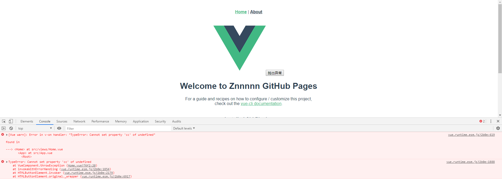
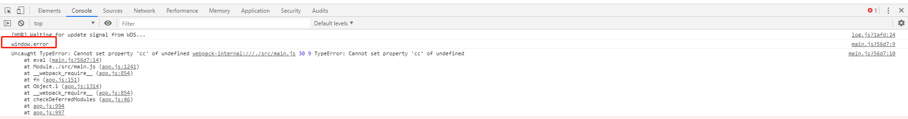
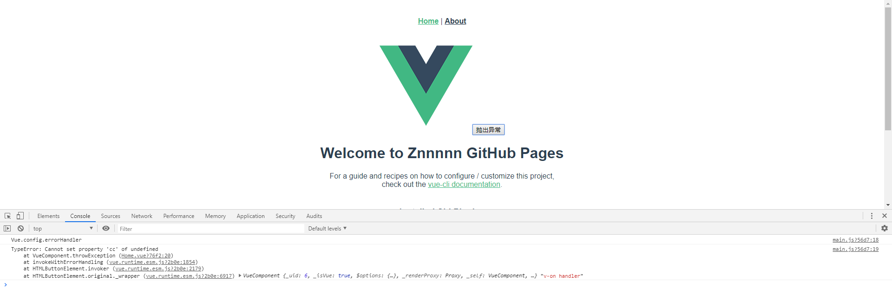
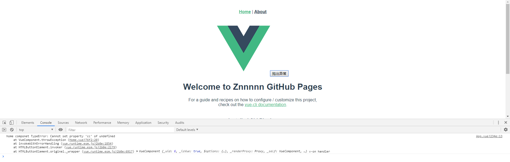

# Vue 组件异常机制
---
*2020/10/31*

## 前言

::: tip
  近日看到同事在研究前端监控，我也跟着去凑凑热闹，于是就从最基本的 **window.onerror** 事件开始，在 Vue 项目的 main.js 文件中注册好 window.onerror 事件，然后故意在一个 Vue 组件中抛出一个异常，奇怪的事情发生了，注册的 onerror 事件并没有被触发，错误直接被打印到控制台输出了。相关代码如下：

``` js
// main.js
import Vue from 'vue'
import App from './App.vue'
import router from './router'
import store from './store'

Vue.config.productionTip = false

window.onerror = (msg, url, lineNo, columnNo, error) => {
  console.log('window.error')
  console.log(msg, url, lineNo, columnNo, error)
}

new Vue({
  router,
  store,
  render: h => h(App)
}).$mount('#app')

// Home.vue
<template>
  <div class="home">
    
    <button @click="throwException">抛出异常</button>
  </div>
</template>
<script>
export default {
  name: 'Home',
  methods: {
    throwException () {
      var a = {}
      a.bb.cc = '12'
      console.log(a)
    }
  }
}
</script>
```

  
:::

## 解决问题

::: tip
  对于 **window.onerrer** 事件，MDN 上是这么解释的。
:::

::: warning
  当JavaScript运行时错误（包括语法错误）发生时，window会触发一个ErrorEvent接口的error事件，并执行window.onerror()。
:::

::: tip
  我还测试了下在 main.js 中抛出异常，此时的异常是可以被 window.onerror 捕获到的。

``` js
// main.js
window.onerror = (msg, url, lineNo, columnNo, error) => {
  console.log('window.error')
  console.log(msg, url, lineNo, columnNo, error)
}

var a = {}
a.bb.cc = '12'
console.log(a)
```

  
:::

::: tip
  window.onerror 事件注册没问题，那就应该是 Vue 框架这边了，再看看 Vue 文档，会发现它提供了两个错误处理函数，分别是全局的 **Vue.config.errorHandler** 和 Vue 实例生命周期钩子函数 **errorCaptured**，分别看看它们的解释：
:::

### Vue.config.errorHandler

::: warning
``` js
Vue.config.errorHandler = function (err, vm, info) {
  // handle error
  // `info` 是 Vue 特定的错误信息，比如错误所在的生命周期钩子
  // 只在 2.2.0+ 可用
}
```

  指定组件的渲染和观察期间未捕获错误的处理函数。这个处理函数被调用时，可获取错误信息和 Vue 实例。
:::

### errorCaptured

::: warning
  方法定义：**(err: Error, vm: Component, info: string) => ?boolean**，当捕获一个来自子孙组件的错误时被调用。此钩子会收到三个参数：错误对象、发生错误的组件实例以及一个包含错误来源信息的字符串。此钩子可以返回 false 以阻止该错误继续向上传播。
:::

## 测试

::: tip
  那就试试这两个方法首先在 main.js 中把注册 **window.onerror** 事件改为注册 **Vue.config.errorHandler**，其他不变：

``` js
// main.js
Vue.config.errorHandler = (error, vm, info) => {
  console.log('Vue.config.errorHandler')
  console.log(error, vm, info)
}
```

  结果如下：

  

  可以看到 Vue.config.errorHandler 方法生效了。

  再试试 **errorCaptured** 方法，这个得在 Home.vue 组件的父组件中声明，它的父组件为 App.vue，如下

``` js
// App.vue
export default {
  errorCaptured (error, vm, info) {
    console.log('home componet', error, vm, info)
    return false
  }
}
```

  结果如下：
  

  因为 errorCaptured 方法返回 false，所以错误不会继续向上传递，只调用了 errorCaptured 方法，符合预期。
:::

## 源码实现

::: tip
  相关的源码在 **src/core/util/error.js** 文件内，它导出一个 **handleError** 方法，文件代码比较简单，全部代码如下：

``` js
// 捕获到 Vue 组件中的异常时，会执行这个方法
export function handleError (err: Error, vm: any, info: string) {
  if (vm) {
    let cur = vm
    // 从当前组件开始，依次调用父组件中的 errorCaptured 方法
    while ((cur = cur.$parent)) {
      const hooks = cur.$options.errorCaptured
      if (hooks) {
        for (let i = 0; i < hooks.length; i++) {
          try {
            const capture = hooks[i].call(cur, err, vm, info) === false
            // 如果父组件 errorCaptured 方法返回 false，则直接 return，结束异常处理流程
            if (capture) return
          } catch (e) {
            // 如果 errorCaptured 方法抛出异常，则将错误抛到 Vue.config.errorHandler 注册的方法中
            globalHandleError(e, cur, 'errorCaptured hook')
          }
        }
      }
    }
  }
  // 最后再抛到 Vue.config.errorHandler 注册的方法中
  globalHandleError(err, vm, info)
}

function globalHandleError (err, vm, info) {
  if (config.errorHandler) {
    try {
      return config.errorHandler.call(null, err, vm, info)
    } catch (e) {
      // 如果 Vue.config.errorHandler 方法抛出异常，则直接将错误打印到控制台
      logError(e, null, 'config.errorHandler')
    }
  }
  // 如果没有注册 Vue.config.errorHandler 方法，直接将错误打印到控制台
  logError(err, vm, info)
}

function logError (err, vm, info) {
  if (process.env.NODE_ENV !== 'production') {
    warn(`Error in ${info}: "${err.toString()}"`, vm)
  }
  /* istanbul ignore else */
  if ((inBrowser || inWeex) && typeof console !== 'undefined') {
    console.error(err)
  } else {
    throw err
  }
}
```

  Vue 组件中的异常处理逻辑还是比较简单的，先是 errorCaptured 处理，最后是 globalHandleError 处理，就算什么都不做，Vue 也只是将错误通过 **logError** 方法将错误输出到控制台，Vue 框架自己消化掉，防止程序奔溃，这样 Vue 组件中的异常通过 **window.onerror** 是捕获不到的。

  源码中的方法调用都通过try catch 包裹起来了，并在catch块中调用 **handleError** 方法，这样项目中的运行时错误都可以被捕获到。

``` js
// src/core/util/next-tick.js  nextTick 方法
callbacks.push(() => {
  if (cb) {
    try {
      cb.call(ctx)
    } catch (e) {
      handleError(e, ctx, 'nextTick')
    }
  } else if (_resolve) {
    _resolve(ctx)
  }
})
```
:::

## window.onerror 注意事项

::: warning
  当加载自不同域的脚本中发生语法错误时，为避免信息泄露，语法错误的细节将不会报告，而代之简单的 **"Script error."**。在某些浏览器中，通过在/<script/>使用crossorigin属性并要求服务器发送适当的 CORS HTTP 响应头，该行为可被覆盖。一个变通方案是单独处理"Script error."，告知错误详情仅能通过浏览器控制台查看，无法通过JavaScript访问。
:::

::: tip
  就是说如果在加载第三方脚本出现异常时，正常情况下是捕获不到错误信息的，只是显示 **"Script error."**，如果想要获取后台返回的详细信息，可以设置 script 标签的 crossorigin 属性。[crossorigin](https://developer.mozilla.org/en-US/docs/Web/HTML/Attributes/crossorigin)

  [回首页](/frontend)
:::

（完）