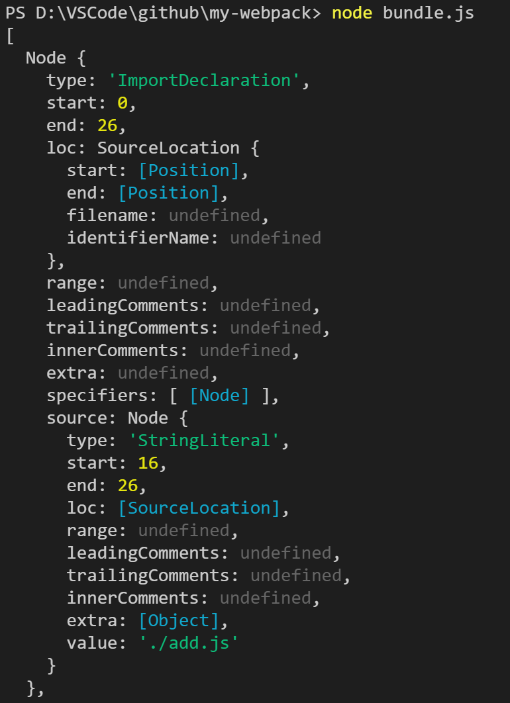

# Webpack 简单实现
---
*2020/10/24*

## 前言
::: tip
  webpack 是什么，就不多介绍了，摘自官网描述：
:::

::: warning
  本质上，webpack 是一个现代 JavaScript 应用程序的静态模块打包器(module bundler)。当 webpack 处理应用程序时，它会递归地构建一个依赖关系图(dependency graph)，其中包含应用程序需要的每个模块，然后将所有这些模块打包成一个或多个 bundle。
:::

::: tip
  为什么会出现webpack呢，主要是之前js程序模块化太混乱了，虽然大家都有一个文件为一个模块的共识，但是当在一个文件引用多个模块时，非常容易造成命名冲突，使得程序非常不好维护，虽然后面有过增加命名空间的辅助方法，但并没有从根本上解决模块命名冲突的问题，因为引入的模块都是全局的，只要命名空间相同，都会覆盖掉之前存在的(如果存在的话)，后面通过函数作用域才从根本上解决这个问题，我的模块我只暴露我想给你使用的属性或者方法，其他的作为我的函数作用域变量，你访问不到。

  webpack 在这个基础上更进一步，只需要给他提供一个我们程序的入口，它就能将我们的模块依赖整理的妥妥当当，并且各模块之间是完全相互独立，下面看看它是怎么做到这一切的。
:::

## webpack 打包工作流程

::: tip
  webpack 配置属性不多介绍了，只是把它的工作流程简单说下，方便理解：
* 读取入口文件内容
* 分析入口文件，递归读取模块依赖的文件内容，生成 **AST** 语法树
* 根据 **AST** 语法树，生成浏览器能够运行的最终代码
:::
::: tip
  根据执行过程还有几个细节再说明下：
* 获取主模块内容
* 分析模块内容
  * 通过 **@babel/parser** 包转成 **AST**
* 对模块内容处理
  * 通过 **@babel/traverse** 包遍历 **AST**
  * 通过 **@babel/core** 和 **@babel/preset-env** 包将ES6转成ES5
* 递归所有模块
* 生成最终代码
:::

## 代码实现

### 项目结构

::: tip
  新建一个项目 my-webpack，目录很简单，如下：

``` js
--src
----add.js
----auto-add.js
----index.js
----minus.js
--index.html
```

  各文件内容也很简单，如下：

``` js
// src/add.js
import autoAdd from './auto-add.js'

export default (a, b) => {
  return autoAdd(a) + b
}

// src/auto-add.js
export default a => ++a

// src/index.js
import add from './add.js'
import { minus } from './minus.js'

const sum = add(1, 2)
const division = minus(5, 3)

console.log(sum, division)

// src/minus.js
export const minus = (a, b) => {
  return a - b
}

// index.html
<!DOCTYPE html>
<html lang="en">
<head>
  <meta charset="UTF-8">
  <meta name="viewport" content="width=device-width, initial-scale=1.0">
  <title>Document</title>
</head>
<body>
  <script src="./src/index.js"></script>
</body>
</html>
```

  在浏览器打开 index.html 文件，会发现在控制台报错，浏览器不能正确的识别引入的 index.js 文件
  

  可能有人会想给script加个 **type="module"** 属性，因为 index.js 文件内是 ESM 引入模块的，浏览器能正确解析了，但是加上了也会报跨域方面的错误，需要启动本地服务来解决，好了这个问题不深究了，继续 webpack 原理
:::

### webpack 打包入口 bundle.js

#### 生成 AST树
::: tip
  在项目根目录(index.html同级)新建 bundle.js 文件，首先引入需要的模块，调用 @babel/parser 包将入口文件 **src/index.js** 转换成 **AST树**，看看生成的 AST 结构是怎样的：

``` js
// bundle.js
const fs = require('fs')
const parser = require('@babel/parser')
const traverse = require('@babel/traverse').default
const path = require('path')
const babel = require('@babel/core')

const getModuleInfo = (file) => {
  const body = fs.readFileSync(file, 'utf-8')
  const ast = parser.parse(body, {
    sourceType: 'module' // 表示我们要解析的是es6模块
  })

  console.log(ast)
}

getModuleInfo('./src/index.js')
```

  命令行执行 node bundle.js ，结果如下：
  

  可以看到生成的 AST树 属性很多，看看我们需要的属性 **ast.program.body**, 它是一个数组，里面包含很多解析到的 **Node结点**，Node结点有两个属性是我们需要关注的，一个是 **type** 属性，标识这个 Node的类型，一个是 **source.value**，标识对应的值，这里就直接说吧，我们需要关注 type值为 **ImportDeclaration** 的Node结点，它表示这里有个依赖(路径为source.value)需要去加载，其他属性如下图：
  
  
  
:::

#### 遍历 AST树

::: tip
  入口文件的 AST树 已经生成了，遍历它所依赖的模块，并在这里完成 ES6 代码向 ES5 转的过程 getModuleInfo 方法定义如下：

``` js
// bundle.js
const getModuleInfo = (file) => {
  const body = fs.readFileSync(file, 'utf-8')
  const ast = parser.parse(body, {
    sourceType: 'module' // 表示我们要解析的是es6模块
  })

  const deps = {} // 收集依赖路径
  // 遍历 AST树
  traverse(ast, {
    ImportDeclaration({ node }) {
      const dirname = path.dirname(file)
      const abspath = './' + path.join(dirname, node.source.value)
      // 这里用 node.source.value 作为 key
      deps[node.source.value] = abspath
    }
  })

  // 使用 babel插件的 @babel/preset-env 预设，将 ES6 代码转换为 ES5
  const { code } = babel.transformFromAst(ast, null, {
    presets: ['@babel/preset-env']
  })
  const moduleInfo = { file, deps, code }
  console.log(moduleInfo)

  return moduleInfo
}
```

  最后我们将处理完毕的入口文件模块信息打印出来看下都包含哪些信息：
  

  从getModuleInfo() 方法的返回值我们我们可以知道几个关键信息，file属性是当前文件名，deps代表当前模块所依赖的其他模块，它是一个对象，属性名是当前文件引入时所用的路径，属性值是它的绝对路径，方便后面继续解析，code属性就是转换过后的ES5代码，现在还不能直接放到浏览器中执行，因为里面一些函数还没有定义，比如:require，我们先递归解析文件所依赖的所有模块。
:::

#### 递归 AST树

::: tip
  为方便递归，我们新增加一个 **parseModules** 方法，定义如下：

``` js
const parseModules = (file) => {
  // 依赖树
  const depsGraph = {}
  // 获取文件信息
  const entry = getModuleInfo(file)
  const temp = [entry]
  // 遍历 deps 属性中依赖的其他模块
  for(let i = 0; i < temp.length; i++) {
    const deps = temp[i].deps
    if(deps) {
      // 遍历模块依赖， 递归获取模块信息
      for(const key in deps) {
        if(deps.hasOwnProperty(key)) {
          // 将依赖的模块信息都放入temp数组，保证后面解析到的依赖模块也能被解析到
          temp.push(getModuleInfo(deps[key]))
        }
      }
    }
  }

  // 将所有依赖放入 depsGraph 对象，属性名为文件绝对路径
  temp.forEach(moduleInfo => {
    depsGraph[moduleInfo.file] = {
      deps: moduleInfo.deps,
      code: moduleInfo.code
    }
  })

  console.log(depsGraph)
  return depsGraph
}
```

  这是一个递归的过程，所有的依赖信息都保存在 **depsGraph** 对象中，先看看这个对象的样子：
  

  到这里依赖树构建好了，如果要在浏览器中执行依赖树中code属性中的代码，还有一个问题要解决，就是定义一个**require** 方法，这个方法是 CommonJS 中实现的，即在 NodeJS 环境中才存在，浏览器并不能识别，它的原理也不复杂，我们在最外面定义一个 require 方法即可。 
:::

#### 让代码在浏览器中跑起来

::: tip
  我们再定义一个 **bundle** 方法，它返回一个代码字符串，这串内容就是当浏览器发起请求时返回给浏览器让浏览器执行的最终代码，如下：

``` js
const bundle = file => {
  // 从入口文件开始，获取相关文件信息
  // 转成字符串，处理完两个关键字(require, exports)后 再返回字符串
  const depsGraph = JSON.stringify(parseModules(file))
  return `
    (function(graph){
      function require(file) {
        function absRequire(relPath) {
          // 转换为绝对路径，取它的值，不然有可能读不到
          return require(graph[file].deps[relPath])
        }
        var exports = {}
        
        Function('require', 'exports', graph[file].code)(absRequire, exports)

        return exports
      }

      require('${file}')
    })(${depsGraph})
  `
}
```

  CommonJS 中，每个模块都是通过 **module.exports** 方式导出的，我们这里也类似，将模块要导出的内容保存在 exports对象中，以返回值形式返回。

  这里有些地方用 **eval** 方法代替了 **Function** 方法，但是官方已经不推荐继续使用eval方法了，从安全和效率方面都没有Fuanction方法好。

  最后将生成的字符串内容写入到一个最终打包文件，让index.html直接引入该文件，浏览器打开 index.html 查看结果

``` js
const content = bundle('./src/index.js')

// 写入到 dist 目录下

fs.mkdirSync('./dist')
fs.writeFileSync('./dist/bundle.js', content)

// index.html 改为 <script src="./dist/bundle.js"></script>
```

  
:::

## 总结

::: tip
  webpack 在前端构建中为什么能独霸天下，它强大的功能是一方面，这里只是简单实现了下js文件打包功能，它能对所有资源文件进行打包构建。另一方面是它的灵活性，给它适当的配置，它能做的还有很多，比如这里我们使用了babel插件对js文件进行处理，如果使用 **vue-loader**、**css-loader** 等loader，还能对 ***.vue**、 ***.css**  文件进行处理 ，并且我们能知道什么时候会执行这些loader，即在读取文件之前根据文件名后缀判断该使用哪个loader，然后再将读取出来的文件内容交给指定的loader去处理，并且某种类型的文件还可以有多个loader，它们的处理内容会一路传递下去。

  除此之外，还可以给webpack配置合适的 **plugin**，如果说 loader 是一个翻译官的话，那 plugin 就像是高速路上的休息站，告诉你已经到了哪里，你可以在这里中断一下，做你想做的事。用专业点的话说是这里用到了设计模式中的 **IOC(依赖注入)** 设计模式， 在webpack编译的过程中给开发者留了足够多的口子，开发者通过 plugin 通过这个口子注入想执行的操作，比如在编译过程想移除文件中的注释，或者打包结束后想对生成文件再进行一次压缩，通过 plugin 都可以实现。

  [项目地址](https://github.com/nandehutuzn/my_webpack)

  [回首页](/frontend)
:::

（完）