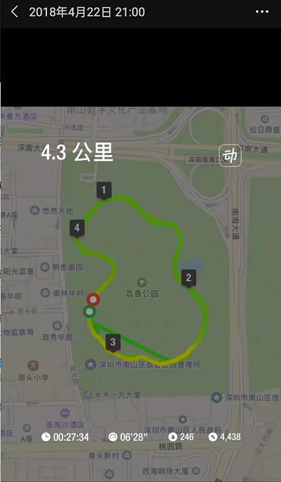
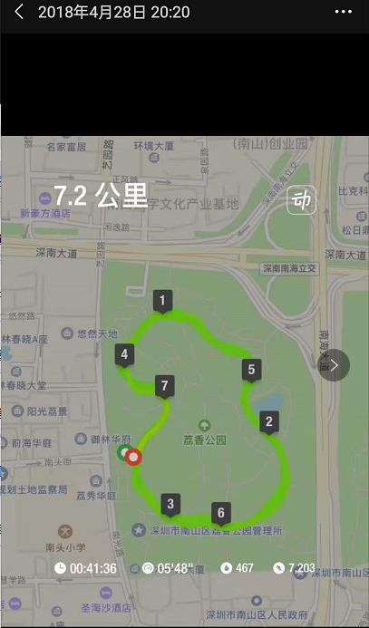
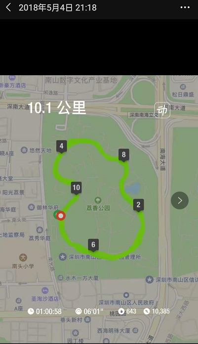
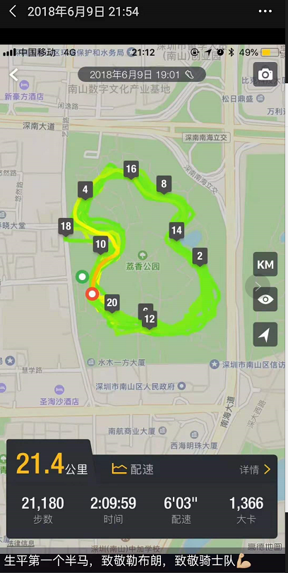

# 一个普通人的马拉松
---
*2020/11/28*

## 前言

::: tip
  自己从18年4月开始跑步，我的跑步起点非常低，记得大学毕业时男生1000m考试，全力跑，还是用了六分多，反正是最后那一批人。18年春节回来体重飙升，于是就开始了跑步减肥计划，所以减肥是初衷。
:::

## 起步到完成第一个半马

::: tip
  第一次跑具体时间应该是2018/4/20，里程是2.8km，在公园里的两圈。那个时候跑得也比较勤，隔一天跑一次，所以里程加得也比较快，3圈、一个礼拜后7km、再一个礼拜后10km、再一个月后直接上半马，那天晚上也是比较兴奋，偶像的力量吧。

  

  

  

  

  现在想想，一个半月，里程从3km暴增到21km，确实还可以，当时怎么想的,估计和现在差不多，只要确实有效，那就坚定不移，做下去。当时的有效是指减肥，一个多月减了20多斤。
:::

## 为配速而战

::: tip
  很快能跑完半马了，一直到现在也没有跑全马的打算，跑一次时间太长了。里程不加了，那自然就是关注配速。很多时候开跑之前会先预定一个配速目标，跑步的过程中听着每公里耗时播报，及时调整。效果肯定还是有的，但后来跑步频率没那么高了，进不不怎么明显。更重要的一点，跑步爱好者的配速瓶颈，我看过一片报道，配速 5:00-6:00 的是跑步爱好者、配速 3:30-5:00 的是业余选手、配速 3:30 以内的是专业选手。个人觉得还是挺准的，我的10km极限就是5分左右，因为我只是跑步爱好者。
:::

## 随心跑

::: tip
  这个我也是近几个月才感悟出来的，跑步过程不再关注配速，任凭双腿往前迈。

  我好像来到珠海之后就喜欢一个人晚上跑了，或者说马拉松注定是个孤独者的运动，就算你们两个人的节奏全程一致，我也很难想象到后半程还会和对方有很多的交流。

  大晚上，空旷的马路，耳边没有了跑步APP的播报，心里也没有了配速目标，那此时大脑在干嘛呢，答案是**静思**，跑步的这两个小时内会想很多很多，近一点的，这周做了什么、做成了什么、没做成什么、原因是什么、能不能改进、身边有没有比较好的做法可以借鉴的...，总之就是对一周工作、学习的复盘。还可以继续想，下周要做什么、学什么，心里想个大概的计划，这个想好了再想远一点的...。

  所以现在每到周五下班都是有点兴奋的，一周可能都在忙着工作、学习，没有静下来思考的时间，这个时间刚好可以用上了。并且这个时间段内不会被打扰、不会分心，你的双腿在不停的奔跑，双臂在不停的摆动，这个时候你可以很专注的去思考自己的事情。并且这里还有一个非常妙的地方，你在跑步过程当中思考的问题基本不会有消极的，就算是非常大的困难，也总能想到缓和之计，具体原因我也解释不清楚，但我感觉和你的双腿在不停的前奔有关。你想啊，你的双腿都还在不停的前进，思维怎么可能落后或者停滞不前呢。

  这一个过程我称它为**大脑的垃圾回收**过程，和程序里面的垃圾回收一个意思，将大脑中的记忆筛选、分类、清除、合并。整个过程下来，大脑会通透很多。

  现在我跑步的重心在思考上，双腿的前进只是惯性而已，所以现在我的配速非常稳定，偶尔看看心率，如果心率高了，稍微降降速，这一般是在开跑阶段比较多，因为刚开始嘛，力量比较足，往往速度起来了心率也超了，为了安全跑完全程，还是求稳。

  我常想一次跑步和人的一生何其相似，因为距离太过漫长，不追求速度，追求长度，长度固定了，追求稳定，稳定达到了，追求蓄力，蓄力达到了，最后脱颖而出吧。是不是和人生很类似，没有突然的成功，只是他在蓄力的时候你没看到而已。好像美团的企业文化就包含一条 '**长期有耐心**'，挺喜欢的。
:::